## 👉목차👈

⚡️[PART 03 요구사항 확인](#part-03-요구사항-확인)

⚡️[PART 04 데이터 입출력 구현](#part-04-데이터-입출력-구현)

⚡️[PART 05 통합 구현](#part-05-통합-구현)

⚡️[PART 06 서버 프로그램](#part-06-서버-프로그램)

⚡️[PART 07 화면 설계](#part-07-화면-설계)

⚡️[PART 08 애플리케이션 테스트 관리](#part-08-애플리케이션-테스트-관리)

⚡️[PART 09 SQL 응용](#part-09-sql-응용)

⚡️[PART 10 소프트웨어 개발보안 구축](#part-10-소프트웨어-개발보안-구축)

⚡️[PART 11 프로그래밍언어 활용](#part-11-프로그래밍언어-활용)

⚡️[PART 12 응용 SW 기초기술 활용](#part-12-응용-sw-기초기술-활용)

⚡️[EXTRA1 인터페이스 구현](#extra1-인터페이스-구현)

<hr>


## PART 03 요구사항 확인


1. #### 다음을 설명하는 것은?

```
- 응용 소프트웨어 개발의 생산성 향상에 많은 도움을 줌
- 응용 소프트웨어 가동을 위해 하드웨어, 소프트웨어, 네트워크 등 다양한 주변기기 등이 결합된 형태
- 장점으로 개발과 운영을 쉽게 하며 비용 감소의 효과가 있음
```

<details> <summary>답</summary> <div markdown="1">  


  ```
플랫폼
  ```

</div> </details>

2. #### 현행 시스템을 차악하기 위한 3단계 수행활동은?


<details> <summary>답</summary> <div markdown="1">  


  ```
1. 구성/기능/인터페이스 파악
2. 아키텍쳐 및 소프트웨어 구성 파악
3. 하드웨어 및 네트워크 구성 파악
  ```

</div> </details>

3. #### 애플리케이션 소프트웨어를 구축하고 통합을 위한 정의 및 프로토콜 세트로, 공개된 애플리케이션 프로그래밍 인터페이스는?


<details> <summary>답</summary> <div markdown="1">  


  ```
Open API
  ```

</div> </details>

4. #### 어떤 요구사항 도출 기법인가?

```
- 여러 명으로부터 정보를 얻는 효과적 방법
- 인터뷰와 같이 수행하면 더 많은 정보 추출이 가능하며 훈련된 요원의 주재로 과정을 정돈하는 것이 성공의 키 포인트
- JAD(Joint Application Development): 사용자와 개발자가 공동 참여하여 프로토타입 기반의 작업을 수행함으로써 비즤니스 요구사항을 명확히 도출하고 그에 따라 시스템을 설계 및 개발
```

<details> <summary>답</summary> <div markdown="1">  


  ```
브레인스토밍
  ```

  ##### 해설

    - 인터뷰: 요구사항을 도출한 사용자를 대상으로 인터뷰 수행, 필요 시 녹음
    - 관찰: 개인의 업무처리 방법이나 절차에 대해 직접적으로 관찰하는 방법으로 요구사항을 명확히 설명하기 힘들거나 어려움이 있는 경우 사용
    - 프로토타입: 요구사항에 대해 이해를 하기 위하여 기본적인 기능만 빠르게 구현하여 사용자로부터 피드백을 받는 기법
    - 벤치마킹: 경쟁 제품, 성공 사례 및 업무 절차를 참조하여 유사한 수준의 효과를 낼 수 있는 기능 요구 사항 정의
    - 사용자 스토리텔링: 사용자의 요구사항을 이야기 형식으로 기술하여 자연스럽게 개발자가 요구사항에 대한 이해가 가도록 구성하는 기법
    - 문헌조사: 유사 프로젝트 및 업무 문서나 양식을 조사하여 현재 시스템 정보에 대해 이해 도출, 그 외 산업 및 기업 표준, 관련 정부 정책, 규제 등 문서 조사
    - 업무절차 및 양식조사: 업무 관련 문서, 절차, 양식, 운영 메뉴얼 등을 조사함으로써 업무절차와 처리 입출력의 이해
    - 설문: 이해당사자들로부터 요구를 찾는 도구

</div> </details>

5. 설명하는 요구공학 단계는 무엇인가?

```
요구사항들 간 상충되는 것을 해결하고, 소프트웨어 범위를 파악하며 소프트웨어가 환경과 어떻게 상호작용하는지를 이해하고, 요구사항을 정제하여 소프트웨어 요구사항을 정리하는 업무
```

<details> <summary>답</summary> <div markdown="1">  


  ```
요구사항 분석
  ```

  ##### 해설(추가 개념)

**타도분명확**으로 외우기!!!!

    1. 타당성 조사: 시스템 구축 가능성 평가 - 비용, 일정, 기술, 제약 사항 등등
    2. 도출: 소프트웨어가 해결해야 할 문제를 이해하고 요구사항이 어디에 있고, 어떻게 수집할 것인가와 관련되어 있음
    3. 분석: 요구사항들 간의 상충을 해결하고, 소프트웨어 범위를 파악하며 소프트웨어가 환경과 어떻게 상호작용하는지를 이해하고, 요구사항을 정제하여 소프트웨어 요구사항을 정리하는 업무
    4. 명세: 체계적으로 검토, 평가, 승인될 수 있는 문서를 작성하는 것을 의미함
    5. 확인/검증: 분석가가 요구사항을 이해했는지에 대한 확인과 요구사항 문서가 조직의 푲ㄴ에 부합하는지 검증 필요

</div> </details>

6. #### 설명하는 도구는?

```
- 하향식 개발을 위한 시스템 분석 및 설계 문서화 도구
- 시스템 분석용 디자인 도구 및 문서화 기법으로, 시스템을 표현하는 모듈들을 계층적으로 나타내고 각 모듈들을 문서화하기 위해 사용
- 가시적 도표, 총체적 도표, 세부적 도표로 구성
```

<details> <summary>답</summary> <div markdown="1">  


  ```
HIPO(Hierarchy Input Process Output)
  ```

</div> </details>

7. #### 구조화된 요구 사항 명세서를 작성하기 위해 소프트웨어 생명주기의 전체 단계를 연결해 자동화된 일관성 분석기능을 제공해 주는 통합 도구는 무엇인지?

<details> <summary>답</summary> <div markdown="1">  


  ```
CASE(Computer Aided Software Engineering)
  ```

</div> </details>

8. #### 괄호 채우기

```
(1)는/은 소프트웨어 시스템 개발 단계마다 실시하는 비정형 검토 회의로 오류를 조기에 검출하는 데 목적을 두고 리뷰를 통해 오류를 검출하고 문서화함.
(2)는/은 요구사항 명세서 작성자가 요구사항 명세서를 설명하고 이해 관계자들이 설명을 들으면서 결함을 발견하는 형태로 진행.
(3)는/은 소프트웨어 요구, 설계, 원시 코드 등의 저작자 외의 다른 전문가 또는 팀이 검사하여 오류를 찾아내는 공식적 검토 방법.
```

<details> <summary>답</summary> <div markdown="1">  


  ```
1. 워크 스루
2. 동료 검토
3. 인스펙션
!!!워동인!!!!
  ```

</div> </details>

10. #### 괄호 채우기

```
(1)는/은 시스템에서 제공되어야 할 특정 기능을 정의.
(2)는/은 시스템의 전체적 품질이나 기능적 요구사하으이 구현 시 고려해야하는 제약사항을 정의
```

<details> <summary>답</summary> <div markdown="1">  


  ```
1. 기능적 요구사항
2. 비 기능적 요구사항
  ```

</div> </details>

11. #### 컴퓨터 프록래밍의 패러다임 중 하나로 컴퓨터 프로그램을 명령어의 목록으로 보는 시각에서 벗어나 여러 개의 독립된 단위, 즉 객체들의 모임으로 파악하고자 하는 것으로, 각각의 객체는 메시지를 주고받고, 데이터를 처리할 수 있는 프로그래밍 기법은?

<details> <summary>답</summary> <div markdown="1">  


  ```
객체지향 프로그래밍(Object Oriented Programming)
  ```

##### 해설(추가 개념)

```
구성 요소: 클래스, 객체, 속성, 메소드, 메시지
특징: 캡슐화, 추상화, 다형성, 정보은닉, 상속성
```

</div> </details>

12. #### 자료흐름도의 구성 요소에 대한 설명이다. 괄호 채우기

```
(1) : 자료의 처리/반환 과정을 표현
(2) : 자료의 흐름을 표현
Data Store : 파일, 데이터베이스 등 저장소의 위치를 표현
(3) : 자료의 출처와 도착지를 표현
```

<details> <summary>답</summary> <div markdown="1">  


  ```
1. Process
2. Data Flow
3. Terminator
  ```

</div> </details>


13. #### 자료 사전(DD: Data Dictionary) 작성 시 자료의 반복을 의미하는 기호를 쓰시오

<details> <summary>답</summary> <div markdown="1">  


  ```
{}
  ```

  ##### 해설(추가 개념)

| 기호   | 의미                               |
| ------ | ---------------------------------- |
| =      | 자료의 정의(A는 ~로 구성되어 있다) |
| +      | 자료의 연결(A와 B를 연결)          |
| ()     | 자료의 생략(없어도 되는 자료)      |
| [ \| ] | 자료의 선택(A이거나 B)             |
| **     | 자료의 설명                        |


</div> </details>

14. 클라우드 컴퓨팅 서비스 유형 중 가상 운영체제, 프로그래밍 언어 실행환경, 데이터베이스, 웹 서버 등 자원 및 개발도구 등을 제공하는 서비스 유형은?


<details> <summary>답</summary> <div markdown="1">  


  ```
PaaS(Platform as a Service)
  ```

  ##### 해설

    - IaaS(Infra as a Service): 인프라 서비스(가상화 기술, 네트워크 기술을 통해 물리적인 컴퓨팅자원을 분할, 통합, 관리하는 가상머신 환경 서비스 제공)
    - PaaS(Platform as a Service): 플랫폼 제공 서비스(가상 운영체제, 프로그래밍 언어 실행환경, 데이터베이스, 웹 서버 등 자원 및 개발도구 제공)
    - SaaS(Service as a Service): 온디맨드 서비스(클라우드 상에서 응용 소프트웨어와 데이터베이스 등을 제공. 구글 닥수, 네이버 클라우드, 드롭박스 등)

</div> </details>

16. #### 럼바우 방법론의 활동 단계 중 다음 설명하는 단계는?

```
- 자료 흐름도(DFD)를 이용, 다수의 프로세스들 간의 자료 흐름을 중심으로 처리 과정을 표현
- 어떤 데이터를 입력하면 어떤 결과를 구할 것인지 표현
```

<details> <summary>답</summary> <div markdown="1">  


  ```
기능 모델링
  ```

  ##### 해설(추가 개념)

    - 객체 모델링: 정보 모델링이라고도 하며, 시스템에서 요구되는 객체를 찾아내어 속성과 연산 식별 및 객체들 간의 관계를 규정
    - 동적 모델링: 상태 다이어그램을 사용하여 시스템의 행위를 기술하는 모델링
    !!!객동기!!!

</div> </details>

18. 

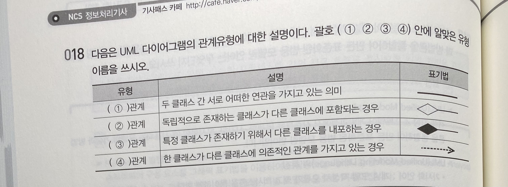


<details> <summary>답</summary> <div markdown="1">  

```
1. 연관
2. 집합
3. 합성
4. 의존
```


  ##### 해설(추가 개념)

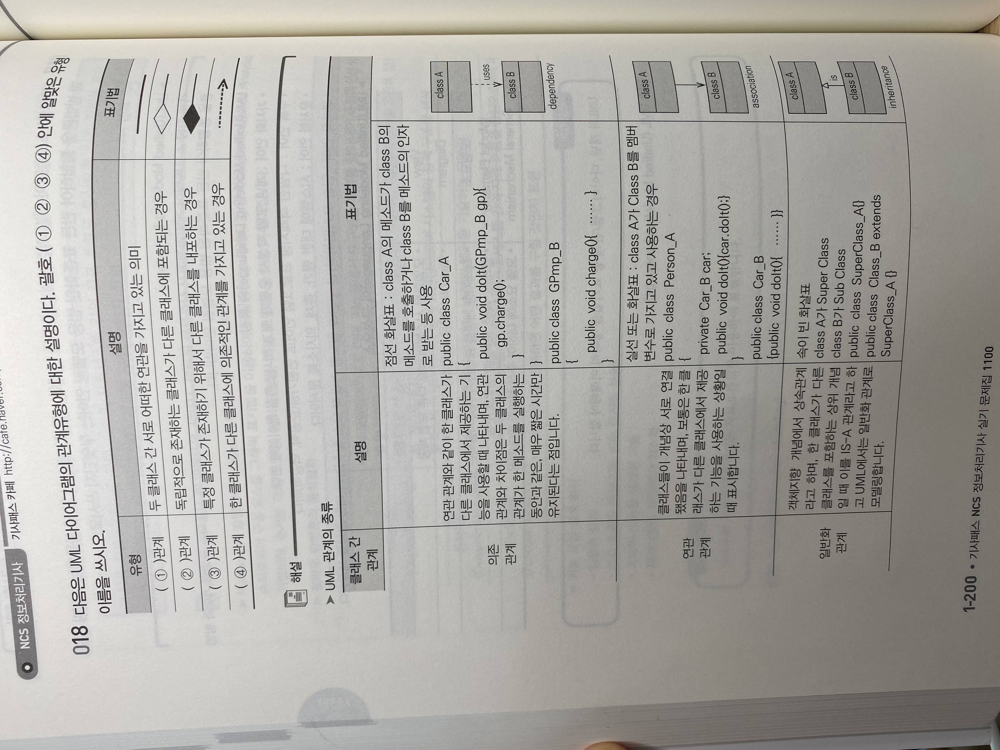

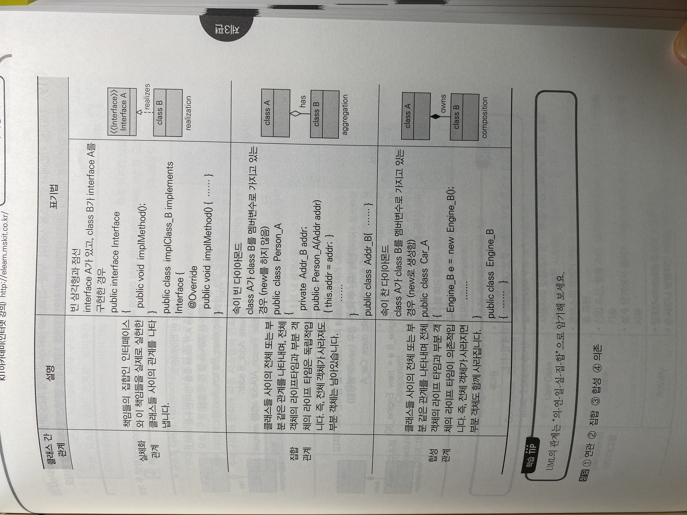

</div> </details>

19. #### 객체지향 기법에서 클래스들 사이의 '부분-전체' 관계 또는 '부분'의 관계로 설명되며 객체의 라이브타입이 의존적인 관계를 나타내는 클래스 관계유형을 쓰시오


<details> <summary>답</summary> <div markdown="1">  


  ```
합성 관계
  ```

  ##### 해설

    - 집합 관계: 클래스들 사이의 전체 또는 부분 같은 관계를 나타내며 전체 객체의 라이프타임과 부분 객체의 라이프 타임은 독립적
    - 합성 관계: 클래스들 사이의 전체 또는 부분 같은 관계를 나타내며 전체 객체의 라이프타임과 부분 객체의 라이프 타임이 의존적

</div> </details>

20. #### 빈칸 채우기

```
()은/는 시스템의 정적 구조와 다양한 추상화 및 구현 수준에서 시스템의 구성 요소, 구성 요소들 간의 관계를 보여주는 UML 다이어그램의 분류 유형으로 Class, Object, Component, Deployment 다이어그램 등이 있다.
```

<details> <summary>답</summary> <div markdown="1">  


  ```
구조적 다이어그램
  ```

  ##### 해설(추가 개념)


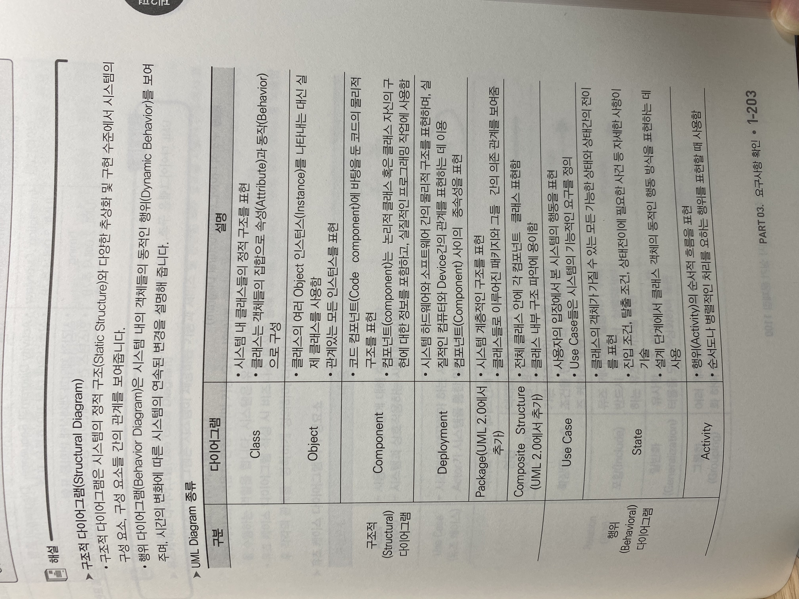

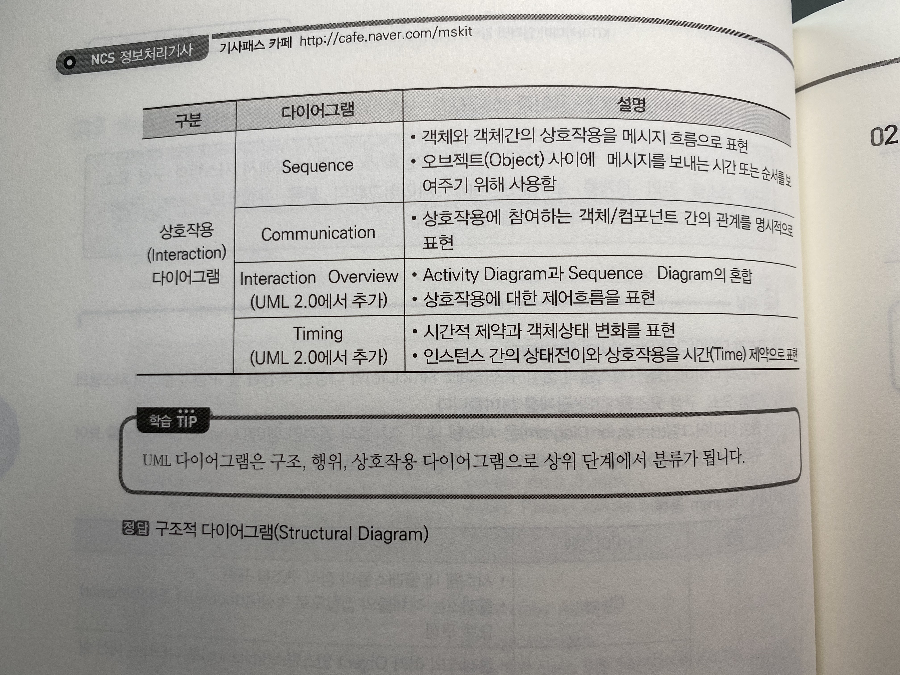

</div> </details>

22. #### 괄호 채우기

```
- (1) 다이어그램은 시스템이 제공하는 기능과 서비스 및 관련된 외부 요소를 사용자 관점에서 표현하는 다이어그램이다.
- 구성요소 중 (2)는/은 시스템의 외부에 있고 시스템과 상호작용을 하는 사람(시스템의 기능을 사용하는 사람), 시스템(시스템의 기능을 사용하는 사람), 시스템(시스템에 정보를 제공하는 또 다른 시스템)을 의미한다.
- 구성요소 중 (1)는/은 사용자 입장에서 바라본 시스템의 기능으로 시스템이 사용자에게 제공해야 하는 기능을 시스템의 요구사항으로 나타낸다.
```

<details> <summary>답</summary> <div markdown="1">  


  ```
1. 유즈케이스
2. 액터
  ```

  ##### 해설(추가 개념)

    유즈케이스 다이어그램 구성 요소
    1. 액터 2. 유즈케이스
    3. 관계: 포함관계(하나의 유즈케이스가 다른 유즈케이스의 실행을 전제로 할 때 형성되는 관계),
    	      확장 관계(하나의 유즈케이스와 다른 유즈케이스 사이에 형성되는 관계를 특정 조건에 따라 확장 대상 유즈케이스를 수						행하는 경우에 적용)

</div> </details>

<hr>

## PART 04 데이터 입출력 구현

> P1-305~307 참고

91. #### 데이터베이스에서 이상현상이란?

<details> <summary>답</summary> <div markdown="1">  


  ```
정규화를 거치지 않으면 데이터베이스의 데이터들이 불필요하게 중복되어 릴레이션 조작 시 문제가 발생하는 현상
  ```

  ##### 해설

추가개념: 이상현상 종류

- **삽입 이상**: 테이블에 데이터를 삽입할 때, 의도와는 관계없이 원하지 않는 값들로 인해 삽입할 수 없는 현상
- **수정(갱신) 이상**: 테이블에서 튜플에 있는 속성값을 갱신할 때 일부 튜플의 정보만 갱신되어 정보에 불일치성이 생기는 현상
- **삭제 이상**: 테이블에서 한 튜플을 삭제할 때, 의도와는 관계없이 값들도 함께 삭제되면 연쇄삭제가 일어나는 현상

</div> </details>

93. #### 데이터베이스에서 정규화 개념?

<details> <summary>답</summary> <div markdown="1">  


  ```
  데이터베이스 이상현상의 원인이 되는 데이터 중복성을 제거하여 데이터의 무결성을 보존하는 기법
  ```

</div> </details>

94. #### 함수종속성이란?

<details> <summary>답</summary> <div markdown="1">  


  ```
 하나의 릴레이션을 구성하는 속성들의 부분 집합을 X와 Y라 할 때, 어느 시점에서든 릴레이션 내의 모든 튜플(행)을 대상으로 한 X 값에 대한 Y 값이 항상 하나면 "X가 Y를 함수적으로 결정한다"
  ```

  ##### 해설

    X -> Y로 표현, Y는 X에 종속된다고 함.

</div> </details>

96. #### 괄호 안에 들어갈 말은?

(): 릴레이션 R이 제1정규형이고, 기본키가 아닌 속성이 기본키에 완전 함수 종속성일 때 정규화 과정<br>

(): 릴레이션 R이 함수 종속성 X->Y가 성립할 때 모든 결정자 X가 후보키 일 때 정규화 과정

<details> <summary>답</summary> <div markdown="1">  


  ```
제2정규화, 보이스/코드 정규화
  ```

  ##### 해설

- 추가개념: 정규화 유형

| 유형                     | 설명                                                         |
| ------------------------ | ------------------------------------------------------------ |
| 제1정규화                | 릴레이션 R의 모든 속성 값이 원자값을 가지는 릴레이션         |
| 제2정규화                | 릴레이션 R이 제1정규형이고, 기본키가 아닌 속성이 기본키에 완전 함수 종속성일 때 정규화 과정(**부분 함수 종속 제거**) |
| 제3정규화                | 릴레이션 R이 제2정규형이고 기본키가 아닌 속성이 기본키에 비이행적 non-transitive으로 종속할 때(직접 종속), (**이행 함수 종속 제거**) |
| 보이스/코드 정규화(BCNF) | 릴레이션 R에서 함수 종속성 X->Y가 성립할 때 모든 결정자 X가 후보키 일 때(**결정자가 후보키가 아닌 함수종속 제거**) |
| 제4정규화                | 릴레이션 R의 모든 속성 X에 대해 A->X이고 A가 후보키일때(**함수종속이 아닌 다치종속 제거**) |
| 제5정규화                | 릴레이션 R에 존재하는 모든 조인 종속이 R의 후보키를 통해 성립되면 R은 5NF(**후보키를 통하지 않은 조인종속 제거**) |

</div> </details>


100. #### 데이터베이스에서 CRUD Matrix의 개념과 점검 기술 서술

<details> <summary>답</summary> <div markdown="1">  
- 개념 : 프로세스와 엔티티의 상관관계를 이용하여 구축된 엔티티 관계도를 검증 도구
- 점검 기준: 
  - 모든 엔티티에 CRUD가 한번 이상 표기되어야함
  - C와 R이 각각 한번 이상 존재해야함
  - 모든 단위 프로세스가 하나 이상의 엔티티에 표기되어야함

</div> </details>


103. #### 추가 개념:

|  종류  | 설명                                                         |
| :----: | ------------------------------------------------------------ |
| 후보키 | - 릴레이션을 구성하는 속성들 중에서 튜플을 유일하게 식별할 수 있는 하나 또는 몇 개의 속성의 집합<br />- 유일성과 최소성을 모두 만족 |
| 기본키 | - 릴레이션의 유일한 식별자(유일성, 최소성 모두 만족)<br />- 기본키로 지정된 속성은 같은 값을 가지지 못함<br />- 후보키 중에서 선정된 키로 중복값을 가질 수 없음<br />- 외래키로 참조 가능, not null, unique |
| 대체키 | - 후보키가 둘 이상 되는 경우에 기본키로 선택되지 못한 후보키들<br />- 후보키 = 기본키 + 대체키 |
| 슈퍼키 | - 유일성만 있고 최소성이 없는 속성의 집합                    |
| 외래키 | - 한 테이블의 키 중 다른 테이블의 튜플을 식별할 수 있는 키   |

105. #### 추가개념:

<details> <summary>답</summary> <div markdown="1">  

  ```
  회원식별구분값, 카드 매체 구분, 프로모션구분
  ```

  ##### 해설
    공통 코드화란? 모든 업무에서 표준 규칙에 의해 동일하게 구분되는 코드값을 의미하며, 공통 코드를 하용함으로서 데이터의 형식과 값의 일관성이 유지되는 이점을 가짐

</div> </details>

107. 다음이 설명하고 있는 기법은?

```
- 어떤 정해진 속성(컬럼) 값을 기준으로, 동일한 값을 가진 하나 이상의 테이블의 튜플(행)를 같은 장소에 저장하는 물리적인 기법
- 디스크로부터 데이터를 읽어오는 시간을 줄이기 위해 조인이나 자주 사용되는 테이블의 데이터를 디스크의 같은 위치에 저장시키는 방법
```

<details> <summary>답</summary> <div markdown="1">  
  ```
  클러스터
  ```

  ##### 해설

    클러스터 장점:
    - 그룹된 컬럼 데이터 행들이 같은 데이터 Block에 저장되기 때문에 디스크 I/O를 줄여줌
    - 클러스터된 테이블 사이에 조인이 발생할 경우 그 처리 시간 단축
    - 클러스터 키 열을 공유하여 한번만 저장하므로 저장 영역의 사용을 줄여줌

</div> </details>


108. #### 파티셔닝이란?

<details> <summary>답</summary> <div markdown="1">  

  ```
검색 연산의 최적화를 위해 데이터베이스 내의 튜플(행)들에 대한 정보를 구성하는 데이터 구조
  ```

  ##### 추가 개념

파티셔닝 범위

| 범위                   | 설명                                                         |
| ---------------------- | ------------------------------------------------------------ |
| Range partitioning     | - 연속적인 숫자나 날짜 기준으로 파티셔닝<br />- 손쉬운 관리 기법 제공에 따른 관리 시간을 단축 |
| Composite partitioning | - 큰 파티션에 대한 I/O 요청을 여러 파티션으로 분산<br />- Range 파티셔닝 결과 생성된 파티션이 너무 커서 효과적으로 관리할 수 없을 때 유용<br />- List와 Hash 파티셔닝 결합하여 사용 |
| Hash partitioning      | - 파티션 키의 해쉬값에 의한 파티셔닝<br />- 조회 시 조건과 무관하게 병령 Degree 제공<br />- 특정 데이터가 해쉬 파티션에 있는지 판단 불가<br />- 해쉬 파티션은 파티션을 위한 범위가 없는 데이터에 적합 |
| List partitioning      | - 특정 파티션에 저장될 데이터에 대한 명시적 제어 가능<br />- 분포도가 비슷하며, 많은 SQL에서 해당 컬럼의 조건이 많이 들어오는 경우 유용 |

</div> </details>

109. #### 인덱스란?

<details> <summary>답</summary> <div markdown="1">  

  ```
  검색 연산의 최적화를 위해 데이터베이스 내의 튜들에 대한 정보를 구성하는 데이터 구조
  ```

</div> </details>

110. #### 인덱스 설계서 기반으로 사원 아이디와 사원이름의 컬럼을 포함한 인덱스 생성 구문 작성

- 테이블명: EMP
- 인덱스명: EMP_IX_01
- 컬럼명 : EMP_ID, EMP_NM
- 데이터타입: NUMBER, VARCHAR2(16)

<details> <summary>답</summary> <div markdown="1">  


  ```
  CREATE INDEX EMP_IX_01 ON EMP(EMP_ID, EMP_NM);
  ```

##### 해설

```
인덱스 생성 구문: CREATE [UNIQUE] INDEX <index_name> ON <table_name> (<columns>);
```

</div> </details>


111. #### 데이터베이스에서 뷰의 개념은?

<details> <summary>답</summary> <div markdown="1">  


  ```
  사용자에게 접근이 허용된 자료만을 제한적으로 보여주기 위해 하나 이상의 기본 테이블로부터 유도된, 이름을 가지는 가상의 테이블
  ```

</div> </details>

112. #### 뷰 설계서 기반으로 뷰 생성 구문

- 뷰 명: VW_EMP
- 테이블 명: EMP
- 컬럼명: EMP_ID, EMP_NM
- 데이터타입: NUMBER, VARCHER2(16)

<details> <summary>답</summary> <div markdown="1">  


  ```
  CREATE VIEW VW_EMP AS SELECT EMP_ID, EMP_NM FROM EMP
  ```

</div> </details>

113. #### 데이터베이스에서 관계의 유형

     _ 관계는 개체 집합 A의 각 원소가 개체 집합 B의 원소 한개와 대응하는 관계<br>

     _ 관계는 개체 집합 A의 각 원소는 개체 집합 B의 원소 여러 개와 대응하고 있지만, 개체 집합 B의 각 원소는 개체 집합 A의 원소 한 개와 대응하는 관계<br>

     _ 관계는 개체 집합 A의 각 원소는 개체 집합 B의 원소 여러 개와 대응하고 개체 집합 B의 각 원소도 개체 집합 A의 원소 여러 개와 대응하는 관계


<details> <summary>답</summary> <div markdown="1">  


  ```
 1. 일대일 2. 일대다 3. 다대다
  ```

</div> </details>

114. #### 데이터베이스에서 슈퍼/서브타입 관계의 개념 서술

<details> <summary>답</summary> <div markdown="1">  


  ```
여러 엔티티에서 공통 속성이 존재할 경우 속성들을 하나로 묶어 통합하는 데이터 모델링 기법
  ```

##### 해설

```
슈퍼타입은 상위 공통 데이터의 내용을 담는 타입, 서브타입은 하위 분할된 정보를 담는 타입
```

</div> </details>

116. #### 다음 보기에서 설명하는 데이터베이스는?

```
- 하나의 데이터베이스 관리 시스템(DBMS)이 여러 CPU에 연결 된 저장장치들을 제어하는 형태의 데이터베이스
- 논리적으로 같은 시스템에 속하지만, 컴퓨터 네트워크를 통해 물리전으로 분산되어 있는 데이터들의 모임
- 데이터베이스를 연결하는 빠른 네트워크 환경을 이용하여 데이터베이스를 여러 지역 노드로 위치시켜 사용성/성능 등을 극대화시킨 데이터베이스
```

<details> <summary>답</summary> <div markdown="1">  


  ```
분산 데이터베이스
  ```

</div> </details>

107. _은 사용하려는 데이터의 저장 장소 명시 불필요. 위치 정보가 시스템 카탈로그에 유지되어야 한다.

<details> <summary>답</summary> <div markdown="1">  


  ```
위치 투명성
  ```

##### 해설

분산 데이터베이스의 투명성

- 분할 투명성(단편화): 하나의 논리적 릴레이션이 여러 단편으로 분할되어 각 단편의 사본이 여러 사이트에 저장
- 위치 투명성: 사용하려는 데이터의 저장 장소 명시 불필요. 위치 정보가 시스템 카탈로그에 유징되어야 함
- 지역사상 투명성: 지역 DBMS와 물리적 DB사이의 매핑 보장. 각 지역 시스템 이름과 무관한 이름 사용 가능
- 중복 투명성: DB 객체가 여러 site에 중복되어 있는지 알 필요가 없는 성질
- 장애 투명성: 구성요소의 장애에 무관한 트랜잭션의 원자성 유지
- 병행 투명성: 다수 트랜잭션 동시 수행 시 결과의 일관성 유지, Time Stamp, 분산 2단계 로킹을 이용 구현

</div> </details>


<hr>


## PART 05 통합구현

129. #### ()에 들어갈 단어는?

```
()은 웹브라우저 간 HTML 문법이 호환되지 않는 문제와 SGML의 복잡성을 해결하기 위하여 개발된 다목적 마크업 언어이다
```

<details> <summary>답</summary> <div markdown="1">  


  ```
XML
  ```

</div> </details>

130. ()에 들어갈 단어는?

```
()은 속성-값 쌍으로 이루어진 데이터 객체를 전달하기 위해 사람이 읽을 수 있는 텍스트를 사용하는 개방형 표준 포맷이다. 비동기 처리에 사용되는 AJAX에서 XML을 대체하여 사용되고 있다.
```

<details> <summary>답</summary> <div markdown="1">  


  ```
JSON
  ```

</div> </details>


131. #### 빈칸 채우기

```
()은 일반적으로 널리 알려진 HTTP, HTTPS, SMTP 등을 통해 XML 기반의 메시지를 컴퓨터 네트워크 상에서 교환하는 프로토콜이다.
()은 SOA(SERVICE Oriented Architecture) 개념을 실현하기 위한 기술이다.
웹서비스는 ()을 객체 접근 프로토콜로 사용하고, WSDL을 통해 웹서비스를 기술하고, UDDI를 통해 웹서비스의 정보를 발행/검색하는 구조이다.
```

<details> <summary>답</summary> <div markdown="1">  


  ```
SOAP(Simple Object Access Protocol)
  ```

  ##### 해설

    Application Layer 프로토콜의 TCP 또는 UDP 포트를 사용으로 인한 방화벽 제약을 SOAP의 HTTP 프로토콜 사용으로 해결

</div> </details>

132. #### 다음이 설명하는 기술은?

```
브라우저가 가지고 있는 XMLHttpRequest 객체를 이용해서 전체 페이지를 새로 고치지 않고도 페이지의 일부분만을 위한 데이터를 로드하는 기법. 최근에는 XML 대신 JSON을 통해 데이터를 주고받는 추세
```

<details> <summary>답</summary> <div markdown="1">  


  ```
AJAX(Asynchronous JavaScript and XML)
  ```

</div> </details>


133. #### ()에 들어갈 단어는?

```
()란 월드와이드 웹과 같은 분산 하이퍼미디어 시스템을 위한 소프트웨어 아키텍쳐의한 형식이다.
()는 "웹에 존재하는 모든 자원(이미지, 동영상, 디비 자원)에 고유한 URI를 부여해 활용"하는것으로, 자원을 정의하고 자원에 대한 주소를 지정하는 방법론을 의미한다.
()의 형식을 따른 시스템을 ()ful 이라고 부른다.
()는 HTTP의 기본 메소드인 PUT,GET,POST,DELETE,PATCH를 사용한다.
```

<details> <summary>답</summary> <div markdown="1">  


  ```
REST(Representational State Transfer)
  ```

</div> </details>


<hr>

## PART 06 서버 프로그램

134. #### 다음을 가리키는 용어는?

```
프로그램 개발에 관련된 모든 작업을 하나의 프로그램에서 처리하는 환경을 제공하는 소프트웨어
```

답: IDE

- 추가 개념:
  - Eclipse: JAVA, JSP
  - Visual Studio: C++, C#, .net
  - IntelliJ: JAVA, Kotlin, Go
  - Xcode: Objective-c, swift


135. #### 추가개념: 형상관리 소프트웨어의 개발을 위한 전체 과정에서 발생하는 모든 항목의 변경사항을 관리하기 위한 활동


136. #### 추가개념: GIT - 컴퓨터 파일의 변경사항을 추적하고, 여러 명의 사용자들 간에 해당 파일들의 작업을 조율하기 위한 형상관리 시스템


137. #### 추가 개념: CI - 지속적인 통합이라는 뜻으로, 여러 사람이 형상관리 도구에 저장한 내용들을 다운받고, 빌드하고, 테스트하는 일련의 작업을 특정 시점이 아닌, 지속적으로 수행하는 것을 말함.

140. #### 코드 빈칸 채우기

```java
class Parent{
  int a;
  public Parent(int a){
    (1).a = a;
  }
}
  class Child (2) Parent{
    public Child(int a){
      (3).(a); //부모 클래스인 Parent의 생성자 중에서 파라미터가 없는 default 생성자가 없음 ->직접 부모의 생성자를 호출해주어야함
      (3).display();
    }
  }
public class Test{
  public static void main(String[] args){
    Child a = (4) Child(10);
  }
}
```

답: this, extends, **super**, new

142. #### 추가개념: 인터페이스의 특징

- 멤버변수를 가질 수 없음
- 함수 선언만 가능, 구현 불가
- 자체로 객체 생성 불가

143. #### 추가개넘: abstract

- 추상 메소드는 선언만 있고, 구현 부분이 없는 메소드로 선언 시 'abstract' 키워드 필요

144. #### & 145 -> Overriding VS Overloading

| Overriding(오버라이딩)                                       | Overloading(오버로딩, 다중정의)                              |
| ------------------------------------------------------------ | ------------------------------------------------------------ |
| - **상속 관계**ㅇㅔ 있는 두 클래스에서 메소드를 하위 클래스에서 재정의<br />- 슈퍼클래스 메소드 무시하기 혹은 덮어쓰기<br />- 메소드 이름 동일, 파라미터 개수 및 데이터 타입 동일, 리턴 타입 동일<br />- 접근 제한자: 하위 메소드의 접근 범위가 상위 메소드의 접근 범위보다 넓가나 같아야 함<br />- 예외 처리: 예외 발생 시 같은 예외 형식이거나,  더 구체적인 예외 형식이어야 한다. | - 메소드를 같은 클래스에서 정의<br />- 메소드 이름 동일, 파라미터 개수 및 데이터 타입 동일, 리턴 타입이 다를 수 있음<br />- 접근 제한자: 상관없음<br />- 예외 처리: 관계 없음 |

147. #### 접근제한자

- public: 모든 범위
- protected: 상속 관계 또는 동일 패키비
- 없을 때: 동일 패키지
- private: 동일 클래스

148. 추가 개념: 객체지향에서 캡슐화는 추상화한 객체를 변수와 함수로 묶어 클래스를 만드는 것을 의미, 정보은닉은 접근제한자를 통해 변수, 함수에 대한 외부접근을 제한

152. #### 아래 코드는 정렬 알고리즘 중 어떤 알고리즘?

```java
class Test{
  static void align(int a[]){
    int temp;
    for(int i=0; i<4; i++){
      for(int j=0; j<4-i; j++){
        if(a[j] = a[j+1]){
          temp = a[j];
          a[j] = a[j+1];
          a[j+1] = temp;
        }
      }
      for(int x = 0; x<5; x++){
        System.out.print(a[x]+" "); //i가 1일때 출력값은?
      }
      System.out.print("₩n");
    }
  }
  public static void main(String[] args){
    int a[] = {7,4,5,1,3};
    align(a);
  }
}
```

답: 버블 정렬(교환 정렬), 4,1,3,5,7

- 추가개념:

  - 버블정렬: 앞의 값이 뒤의 값보다 크다면 둘의 자리를 바꿈

    > P1-406 풀이 참고

154. #### 아래 코드는 정렬 알고리즘 중 어떤 알고리즘?

```java
class Test{
  static void sort(int[] a){
    int n = a.length;
    
    for(int i=0; i<n-1; i++){
      int idxLeast = i;
      
      for(int j=i+1; j<n; j++){
        if(a[j] < a[idxLeast]){
          idxLeast = j;
        }
      }
      
      if(idxLeast != i){
        int tmp = a[i];
        a[i] = a[idxLeast];
        a[idxLeast] = tmp;
      }
      
      for(int x=0; x<a.length; x++){
        System.out.print(a[x] + " "); //i=2일때?
      }
      System.out.print("₩n₩n");
    }
  }
  public static void main(String[] args){
    int a[] = {7,4,5,1,3};
    sort(a);
  }
}
```

답: 선택 정렬 알고리즘 -> 최소값(a[idxLeast])을 찾아서 저장, i와 idxLeast 자리 교환하면서 비교 정렬

- **최솟값을 저장하는 알고리즘은 선택 정렬 알고리즘밖에 없음**

> 추가 설명 p1-411 참고!

156. #### 아래 코드

```java
class Test{
  static void sort(int[] a){
    int n = a.length;
    
    for(int i=1; i<n; i++){
      int key = a[i];
      int j = i-1;
      
      while(j >=0 && a[j] > key){
        a[j+1] = a[j];
        j--;
      }
      a[j+1] = key;
      
      for(int x=0; x<a.length; x++){
        System.out.print(a[x]+" ");
      }
      System.out.print("₩n")
    }
  }
  public static void main(String[] args){
    int[] a={7,4,5,1,3};
    sort(a);
  }
}
```

답: 삽입 정렬 알고리즘

- 추가개념: key값을 저장하여 배열 앞부분부터 비교하여 shift, 저장 반복


166. #### C 코드의 출력 결과는?

```java
int main(){
  int a = 7;
  int b = 5;
  
  int x = a & b;//0101
  int y = a | b; //0111
  int z = a ^ b; //XOR => 0 1 0 0(두 비트가 같으면 0, 다르면 1)
  
  print("%d %d %d", x,y,z);
  return 0;
}
```

풀이: 7 = 0 1 1 1, 5 = 0 0 1 1  


167. #### 다음 코드 출력 결과

```c
int main(){
  int c = 1;
  
  switch(3){ //case3으로 가라는 의미
    case 1: c+=3;
    case 2: c++;
    case 3: c = 0; //여기서 부터 시작해 break만날때 까지 순차적으로 실행
    case 4: c+=3;
    case 5: c-=10;
     break;
    case 6: c++;
    default: c--;
  }
  print("c: %d", c);
  return 0;
}
```

답: 0 + 3 - 10 ->break, -7!


177. #### 3개의 파이썬 파일에서 출력결과는 모두 동일하게 출력될 때 1,2번에 들어갈 코드 채우기

```python
//a.py
import math
print ("pi is", math.pi)

//b.py
import math as m
print('pi is', (1))

//c.py
from math import pi
print('pi is', (2))

//출력값
pi is 3.14156~~~
```

답: m.pi, pi

- 추가 개념:
- import math as m -> math라는 라이브러리를 가져와 m이라는 별칭으로 가져와서 m으로 접근
- from math import pi ->math 라이브러리에서 pi만 가져와서 참조없이 바로 사용 가능


180. #### 코드 출력 결과

```python
a = list(range(1,6,2))# 1부처 6-1까지의 범위의 숫자를 2 간격 range 객체 생성해서 리스트로 바꿈 ->[1,3,5]
a.append(10) #10 추가
a.remove(1) #가장 먼저 발견되는 1 제거

for x in a:
	print(x, end = ' ')
```

딥: 3 5 10


181. #### 코드 출력 결과

```python
a = ('한국','중국','일본')

print(a[0]) #한국
print(a[1:]) #중국, 일본

a[1]='미국'
print(a) #에러 발생 -> 튜플에서 추가,삭제,변경 등이 불가능한 읽기 전용이기 때문
```

182. #### 코드 출력 내용

```python
a = {'사과','배','딸기'} #집합 ->중복 허용 안됨, 순서 없음
a.add('수박') #사과, 배, 딸기, 수박
a.add('배') #사과,배,딸기,수박
a.remove('사과') #배,딸기,수박
a.update({'포도','딸기','귤'}) #배,딸기,귤,수박,포도

print(a)
```

답: {'배','딸기','귤','수박','포도}

<hr>

## PART 07 화면 설계

189. 보기에서 설명하는 용어는?

```
- 사람들이 컴퓨터, 시스템, 기기, 도구 등 그 사이에서 일어나는 상호작용을 매개하는 것
- 사람과 사물 또는 시스템, 기계, 컴퓨터 등 그 사이에서 의사소통을 할 수 있도록 일시적 또는 영구적인 접근을 목적으로 만들어진 물리적, 가상적 매개체
- 디스플레이 화면, 키보드, 마우스, 문자, 아이콘, 도움말 등 사용자들과 상호 작용을 하도록 설계된 모든 정보 관련 고안품을 포함하여, 응용 프로그램이나 웹사이트 등이 상호 작용을 초래하거나 그것에 반응하는 방법 등을 의미함
```

<details> <summary>답</summary> <div markdown="1">  


  ```
사용자 인터페이스(UI)
  ```

</div> </details>

190. UI 설계 원칙 빈칸 채우기

```
1. () : 누구나 쉽게 이해하고 사용 가능해야 함
2. () : 누구나 쉽게 배우고 익힐 수 있어야 함
3. () : 사용자의 요구사항을 최대한 수용하고 실수를 최소화해야함
4. () : 사용자의 목적을 정확하고 완벽하게 달성해야 함
```

<details> <summary>답</summary> <div markdown="1">  


  ```
1. 직관성
2. 학습성
3. 유연성
4. 유효성
~직학유유~
  ```

</div> </details>

191. #### UI 설계 단계 수행 작업 순서 정하기

```
보기:
ㄱ. 사용자 모델 정의
ㄴ. 디자인 평가
ㄷ. 컴퓨터 오브젝트 및 기능 정의
ㄹ. 문제 정의
ㅁ. 사용자 인터페이스 정의
ㅂ. 작업 분석
```

<details> <summary>답</summary> <div markdown="1">  


  ```
ㄹ -> ㄱ -> ㅂ -> ㄷ -> ㅁ -> ㄴ
  ```

</div> </details>

192. #### UI설계에 있어 조직의 브랜드나 정체성과 일치되는 디자인 철학과 원칙이 정리되고 공통으로 사용하는 UI 요소 및 배치규칙 등을 정의하는 문서는 무엇인지 쓰시오.


<details> <summary>답</summary> <div markdown="1">  


  ```
UI 표준
  ```

</div> </details>

193. #### 사용자 인터페이스 설계에서 웹/모바일 서비스의 구축 시 효율적인 정보 전달이 가능하도록 지켜야 할 세부 사항을 규정한 문서는 무엇인지 쓰시오.

<details> <summary>답</summary> <div markdown="1">  


  ```
UI 지침
  ```

</div> </details>

194. #### 사용자 인터페이스 표준에서 사용자 인터페이스를 만들 때 기본 원칙, 레이아웃, 엘리먼트 등 각종 규칙들의 기준이 되는 문서는 무엇인가?

<details> <summary>답</summary> <div markdown="1">  


  ```
스타일 가이드
  ```

</div> </details>

195. #### UI 설계 과정 중 디자이너와 개발자가 최종적으로 참고하는 설계 산출 문서로 정책, 프로세스 및 콘텐츠의 구성, 와이어프레임, 기능정의, 데이터베이스의 연동 등 서비스 구축을 위한 대부분의 정보가 수록되어 있는 문서는 무엇인지 쓰시오.

<details> <summary>답</summary> <div markdown="1">  


  ```
스토리보드
  ```

</div> </details>

196. #### UI 설계 과정 중 사용자의 요구사항을 충분히 분석할 목적으로 시스템의 중요 부분을 우선 구현하고, 이후 요구사항을 반영하는 과정을 재반복하는 개발모델은?

<details> <summary>답</summary> <div markdown="1">  


  ```
프로토타입
  ```

</div> </details>

197.


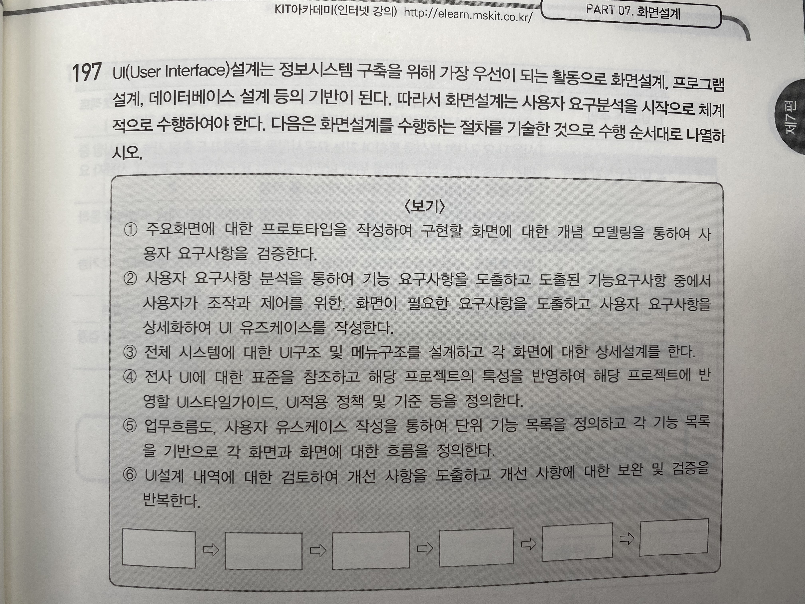


<details> <summary>답</summary> <div markdown="1">  


  ```
4 - 2 - 1 - 5 - 3- 6 
  ```

##### 해설(추가 개념)

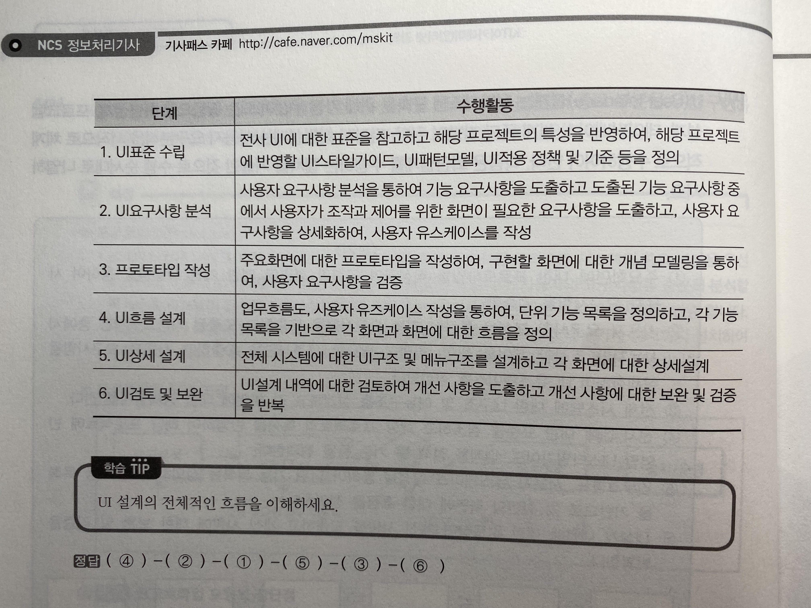

</div> </details>


<hr>

## PART 08 애플리케이션 테스트 관리


199. #### 애플리케이션 테스트의 기본 원리 중에서 오류-부재의 궤변의 개념을 설명하시오

<details> <summary>답</summary> <div markdown="1">  


  ```
사용자 요구와 기대에 만족하지 못해 사용성이 현저히 낮다면 결함을 찾는 과정은 아무 소용이 없다는 의미
  ```

  ##### 해설(추가 개념)

| 원칙                             | 설명                                                         |
| -------------------------------- | ------------------------------------------------------------ |
| 결함이 존재함을 밝힘             | 테스팅은 소프트웨어의 잠재적인 결함을 줄일 수 있지만, 결함이 발견되지 않아도 결함이 없다고 증명할 수 없음 |
| 완벽한 테스팅은 불가능함         | 무한 경로, 무한 입력값, 무한 시간이 소요되어 완벽하게 테스트할 수 없으므로 리스크 분석과 우선순위를 토대로 테스트에 집중할 것을 의미 |
| 테스팅은 개발 초기에 시작해야 함 | 애플리켕이션의 개발 단계에 테스트를 기획하고 SDLC의 각 단계에 맞춰 전략적으로 접근하는 것을 고려 |
| 결함 집중                        | 애플리케이션 결함의 대부분은 소수의 특정한 모듈에 집중되어 존재한다는것을 의미(파레토의 법칙) |
| 살충제 패러독스                  | 동일한 테스트 케이스로 반복 실행하면 결함을 발견할 수 없으므로 주기적으로 테스트 케이스를 리뷰하고 개선해야 함 |
| 테스팅은 정황에 의존             | 정황과 비즈니스 도메인에 따라 테스트를 다르게 수행 하여야 함 |
| 오류-부재의 궤변                 | 사용자 요구와 기대에 만족하지 못해 사용성이 현저히 낮다면 결함을 찾는 과정은 아무 소용이 없다는 의미 |

</div> </details>

200. #### 소프트웨어 테스트에서 전체 결과의 80%가 전체 원인의 20%에서 일어나는 현상은?

<details> <summary>답</summary> <div markdown="1">  


  ```
파레토의 법칙(결함 집중)
  ```

</div> </details>

202. #### 소프트웨어 테스트 절차는 테스트 계획, 테스트 분석 및 디자인, 테스트케이스 및 시나리오 작성, 테스트 수행, 테스트 결과 평가 및 리포팅 순서로 진행됨. 이러한 절차 중에서 테스트케이스 및 시나리오 작성 절차 시 수행활동에는 어떤게 있나?

<details> <summary>답</summary> <div markdown="1">  


  ```
1. 테스트케이스 작1. 테스트케이스 작성성
2. 테스트용 스크립트 작성
3. 테스트케이스 검토
4. 테스트 시나리오 작성
  ```

##### 해설(추가 개념)

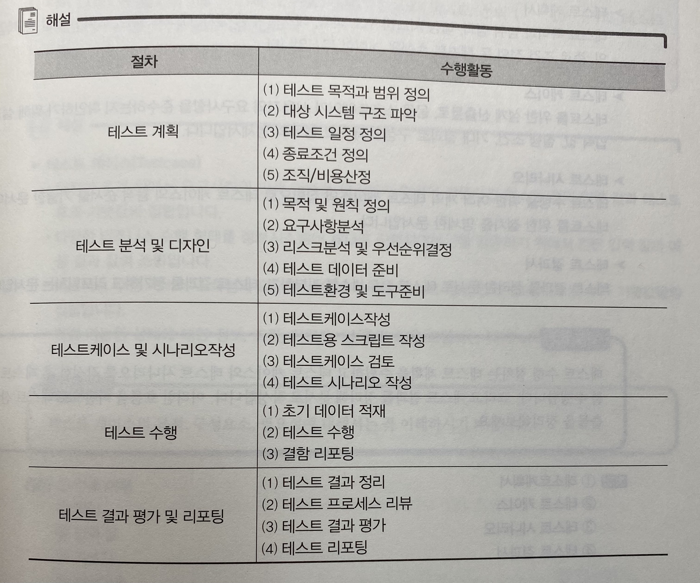

</div> </details>


203. #### 소프트웨어 테스트 수행 시 발생하는 산출물든은 어떤게 있는지 서술

<details> <summary>답</summary> <div markdown="1">  


  ```
1. 테스트 계획서
2. 테스트 케이스
3. 테스트 시나리오
4. 테스트 결과서
  ```

</div> </details>


204. #### 빈칸 채우기

```
- 일정한 조건 하에서 요구사항의 (1)를 (2)하기 위하여 만들어진 테스트 전의 (3)과 테스트 후의 (4)의 집합입니다.
- 비즈니스 수행 (5)의 도구로 사용하기 위해 테스트 전의 (3)과 테스트 후의 (4) 들의 집합입니다.
- 측정 가능한 상태에 대한 정보, 조건, 이벤트, 입/출력 값을 포함하는 데이터로 구성합니다.
```


<details> <summary>답</summary> <div markdown="1">  


  ```
1. 만족 여1. 만족 여지부
2. 확인
3. 입력 값
4. 기댓값
5. 커버리지
  ```

</div> </details>

206. #### 소프트웨어 테스트의 유형을 프로그램 실행 여부에 따른 유형에는 어떤게 있는지 설명


<details> <summary>답</summary> <div markdown="1">  


  ```
1. 정적 테스트: 프로그램 실행 없이 소스코드의 구조를 분석하여 논리적으로 검증하는 테스트 기법
2. 동적 테스트: 프로그램의 실행을 요구하는 테스트 기법
  ```

</div> </details>

207. 빈칸 채우기

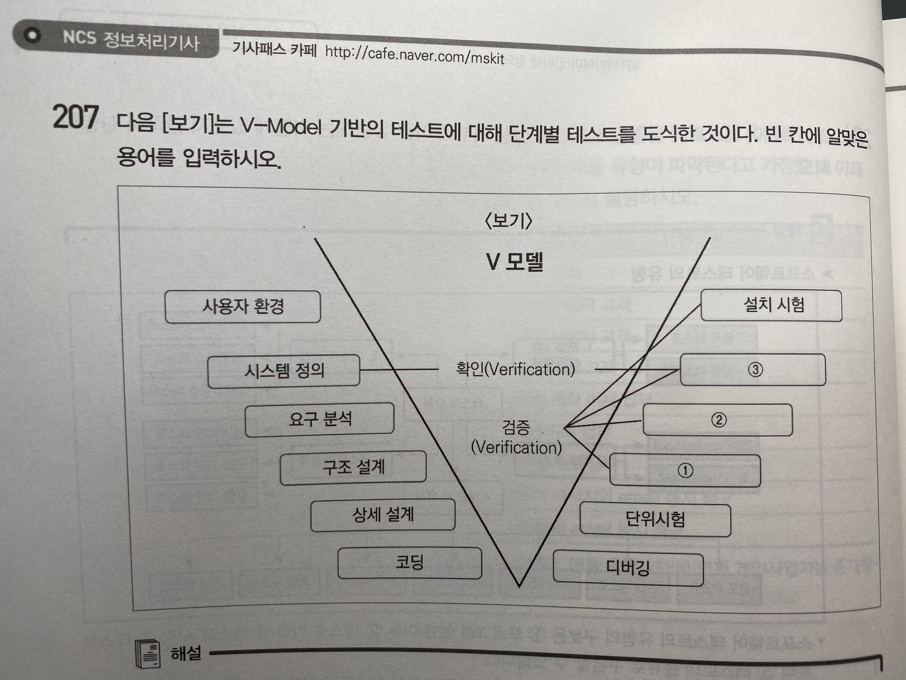


<details> <summary>답</summary> <div markdown="1">  


  ```
1. 통합 시험
2. 시스템 시험
3. 인수 시험
  ```

</div> </details>

208. #### 빈칸 채우기

```
(1) 박스 테스트는 소프트웨어의 내부 구조의 일부만 알고 수행하는 테스트로 블랙박스 시험과 화이트박스 시험이 혼합된 방식의 시험 형태이다.
(2) 박스 테스트는 프로그램 내부의 구조와는 관계없이 외부에 제공하는 기능 중심으로 모든 기능들이 정상적으로 수행되는지 확인한다.
(3)은 프로그램의 내부 로직(수행 경로 구조, 루프 등)을 보면서 테스트를 수행한다.
```


<details> <summary>답</summary> <div markdown="1">  


  ```
1. 그레이 박스
2. 블랙 박스
3. 화이트 박스
  ```

</div> </details>


209. 

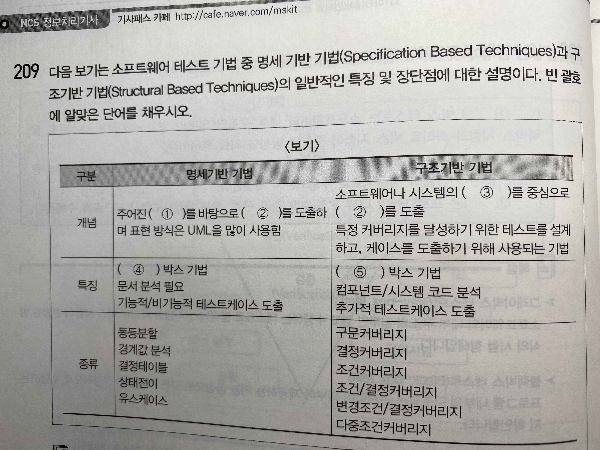


<details> <summary>답</summary> <div markdown="1">  


  ```
1. 명세
2. 테스트케이스
3. 구조
4. 블랙
5. 화이트
  ```

</div> </details>

210. #### 다음에서 설명하고 있는 테스트 기법은?

```
- 테스트 대상 소프트웨어에 대한 지식을 필요로 함.
- 테스트 경험에 따라 효율성 및 효과성의 정도가 변동이 가능함.
- 공식적인 기법으로 다루기 어려운 특별한 케이스를 찾아 실행이 가능함.
```


<details> <summary>답</summary> <div markdown="1">  


  ```
경험 기반 테스트
  ```

</div> </details>

211. 화이트박스 테스트 기법 유형은 어떤게 있는지?

<details> <summary>답</summary> <div markdown="1">  


  ```
1. 데이터 흐름 검사: 프로그램에서 변수의 정의와 변수 사용의 위치에 초점을 맞추어 검사하는 기법
2. 루프 검사: 프로그램의 반복 구조에 초점을 맞추어 검사하는 기법
3. 제어 구문 검사: 프로그램의 제어구문(if, case, else)을 테스트하는 기법
4. 기본 경로 검사: 순환복잡도를 통해 독립적인 경로의 수를 찾아 테스트하는 기법
  ```

</div> </details>

212. #### 설명하고 있는 테스트 기법은?

```
- Tom McCabe에 의해 개발된 기법
- 프로그램의 제어구조를 플로우 그래프로 표현하고, 순환복잡도를 통해 독립적인 경로의 수를 찾아 테스트 케이스를 추출하는 기법
```


<details> <summary>답</summary> <div markdown="1">  


  ```
기본 경로 테스트
  ```

</div> </details>

213. 테스트 커버리지란?

<details> <summary>답</summary> <div markdown="1">  


  ```
소프트웨어의 소스 코드가 얼마만큼 테스트가 되었는가를 나타내는 지표
  ```

</div> </details>

221. #### 빈칸 채우기

```
(1) - 결함의 원인이 되는 것으로 사람(SW 개발자, 분석가 등)에 의하여 생성된 실수가 주를 이룸
(2) - 에러가 원인이 되어 제품에 포함된 것으로 제거하지 않으면 실패 또는 문제의 원인이 됨
(3) - 제품의 결함이 있는 부분이 실행될 때 발생하는 현상
```


<details> <summary>답</summary> <div markdown="1">  


  ```
1. 에러
2. 결함
3. 실패/문제
  ```

</div> </details>

222. 블랙박스 테스트 기법의 유형은?


<details> <summary>답</summary> <div markdown="1">  


  ```
1. 동등분할 기법: 입력값이 범위를 유사한 특징을 갖는 동등 그룹으로 나누고, 각 그룹마다 대표값을 선정하여 테스트케이스를 선정하는 기법
2. 경계값 분석 기법: 경계의 유효한 값과 경계에서 가장 가까운 유효하지 않는 값을 테스트 데이터로 선택하는 테스트 기법
3. 원인 효과 그래프: 입력값을 원인으로, 효과를 출력 값으로 선정하는 테스트 기법
4. 의사결정테이블 테스팅 기법: 생성될 수 있는 결과를 테이블로 나열하여 가능한 모든 조합을 테스트하는 기법
  ```

</div> </details>

226. #### 블랙 박스 테스트 중 도메인 테스트에 대해 설명

<details> <summary>답</summary> <div markdown="1">  


  ```
입력 변수들 간에 상관관계가 존재하는 경우 그 관계에 따라 영역을 분할하고 테스트케이스를 도출하는 방법
  ```

</div> </details>

228. 알파, 베타 테스트와 가장 밀접한 연관이 있는 테스트 단계는?

<details> <summary>답</summary> <div markdown="1">  


  ```
인수 테스트
  ```

</div> </details>

229. 애플리케이션 테스트의 원리 중 "테스팅은 정황에 의존한다"라는 의미란?

<details> <summary>답</summary> <div markdown="1">  


  ```
테스트는 정황과 비즈니스 도메인(분야)에 따라 테스트를 다르게 수행해야 한다
  ```

</div> </details>

230. #### 검증(Validation)검사 기법 중 개발자의 장소에서 사용자가 개발자 앞에서 행해지며, 오류와 사용상의 문제점을 사용자와 개발자가 함께 확인하면서 검사하는 기법은?


<details> <summary>답</summary> <div markdown="1">  


  ```
알파 검사
  ```

##### 해설(추가 개념)

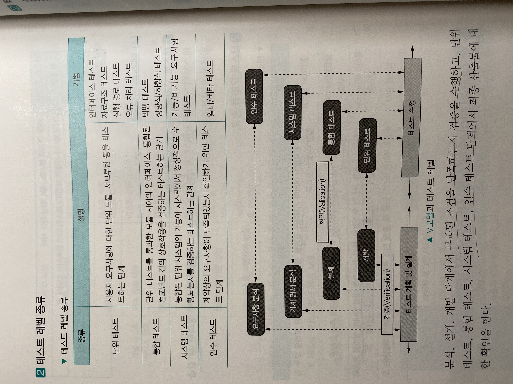

**사용자가 오류와 사용상의 문제점을 테스트하는 것은 인수테스트**

- 알파 테스트: 개발자의 장소에서 사용자가 개발자 앞에서 행해지는 테스트, 오류 발견
- 베타 테스트: 다수의 사용자를 제한되지 않은 환경에서 프로그램을 테스트, 오류 발견

</div> </details>

231. #### 통합 테스트 유형 중 하향식 통합방법(Top-down)이란?

<details> <summary>답</summary> <div markdown="1">  


  ```
메인 제어 모듈(프로그램)로부터 아래 방향으로 제어의 경로를 따라 하향식으로 통합하면서 테스트를 진행하는 테스트 방법
  ```

</div> </details>


232. #### 통합 테스트 유형 중 상향식 통합방법(Top-down)이란?


<details> <summary>답</summary> <div markdown="1">  


  ```
애플리케이션 구조에서 최하위 레벨의 모듈 또는 컴포넌트로부터 위쪽 방향으로 제어의 경로를 따라 이동하면서 구축과 테스트를 수행하는 테스트 방법
  ```

</div> </details>


233. #### 설명하는 테스트는?

```
이미 테스트 된 컴포넌트 중 변경이 발생하면 이를 재 테스트해야 함. 이 때 변경 영향도를 분석하여 영향을 받는 컴포넌트를 중심으로 재 테스트해야 함.
```


<details> <summary>답</summary> <div markdown="1">  


  ```
회귀 테스트
  ```

</div> </details>


234. #### 테스트 오라클이란?

<details> <summary>답</summary> <div markdown="1">  


  ```
테스트의 결과가 참인지 거짓인지 판단하기 위해서 사전에 정의 된 참 값을 입력하여 비교하는 기법
  ```

</div> </details>


235. #### 애플리케이션 성능을 측정하기 위한 요소들을 빈칸에 채우시오

```
(1) : 일정 시간 내에 애플리케이션이 처리하는 일의 양
(2) : 애플리케이션에 요청을 전달한 시간부터 응답이 도착할 때까지 걸린 시간
(3) : 애플리케이션에 작업을 의뢰한 시간부터 처리가 완료될 때까지 걸린 시간
자원 사용률: 애플리케이션의 의뢰한 작업을 처리하는 동안의 CPU 사용량, 메모리 사용량, 네트워크 사용량 등 자원 사용률
```


<details> <summary>답</summary> <div markdown="1">  


  ```
1. 처리량
2. 응답 시간
3. 경과 시간
  ```

</div> </details>

236. #### 애플리케이션을 실행하지 않고, 소스 코드에 대한 코딩 표준, 코딩 스타일, 코드 복잡도 및 남은 결함을 발견하기 위해 사용하는 도구는?


<details> <summary>답</summary> <div markdown="1">  


  ```
정적 분석 도구
  ```

</div> </details>

237. #### 소프트웨어 테스트 작업을 자동화하는 도구 중 프로그램을 실행하지 않고 분석하는 정적 분석 도구 유형은 어떻게 있는지 간략하게 설명하시오

<details> <summary>답</summary> <div markdown="1">  


  ```
1. 구조 검사 도구: 소프트웨어의 내부 구조를 검사 할 수 있는 도구
2. 데이터 분석 도구: 소프트웨어의 내부 데이터 흐름을 분석할 수 있는 도구
3. 순서 검사 도구: 소프트웨어의 실행 순서를 분석할 수 있는 도구
  ```

</div> </details>

238. #### 코드 리팩토링이란?

<details> <summary>답</summary> <div markdown="1">  


  ```
소프트웨어를 외부 동작을 바꾸지 않으면서 내부 구조를 개선하는 방법으로 소프트웨어를 보다 이해하기 쉽고 수정하기 쉽도록 만드는 기법
  ```

</div> </details>

239.

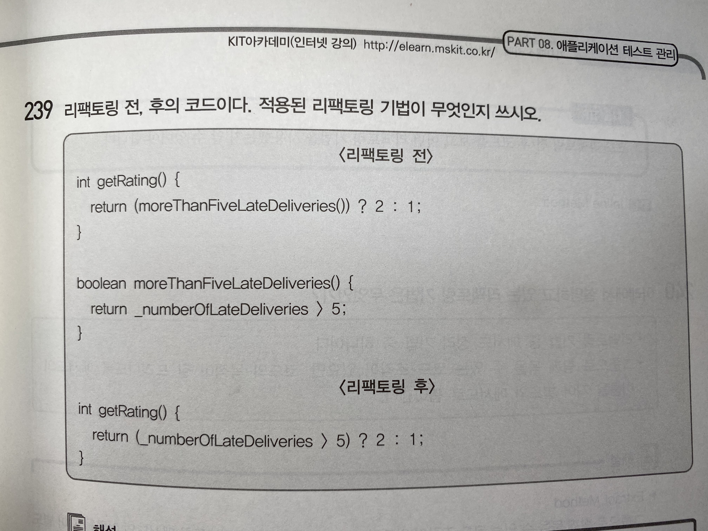

<details> <summary>답</summary> <div markdown="1">  


  ```
인라인 메서드
  ```

##### 해설(추가 개념)

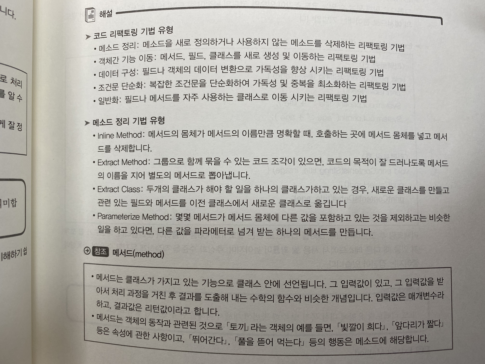


</div> </details>


241. 코드 리팩토링 중 객체간 기능 이동에 대한 설명이다. 빈 칸 채우기

```
(1) - 메소드가 자신이 속한 클래스보다 다른 클래스의 기능을 더 많이 이용할 때 수행하는 리팩토링 기법
(2) - 필드가 자신이 속한 클래스보다 다른 클래스에서 더 많이 사용될 때 사용하는 리팩토링 기법
(3) - 두 클래스가 처리해야 할 기능이 하나의 클래스에 들어가 있을 때, 두 클래스를 분리하기 위해 사용하는 리팩토링 기법
```


<details> <summary>답</summary> <div markdown="1">  


  ```
1. Move Method
2. Move Field
3. Extract Class
  ```

</div> </details>


<hr>


## PART 09 SQL 응용

242. #### 알맞은 SQL 유형은?

- _ : 데이터베이스에 저장된 데이터를 수정,삭제, 추가하는 명령어(INSERT, UPDATE, DELETE)
- _ : 데이터베이스 객체를 생성하고 수정, 삭제하는 명령어(CREATE,ALTER, DROP, TRUNCATE)

<details> <summary>답</summary> <div markdown="1">  

  ```
  데이터 조작어(DML), 데이터 정의어(DDL)
  ```

##### 해설(추가 개념)

```
- 데이터 질의어(DQL): 데이터베이스에 저장된 데이터를 검색하는데 사용하는 질의어(SELECT)
- 데이터 제어어(DCL): 데이터베이스의 규정이나 기법을 정의하고 제어하는 언어(GRANT, REVOKE, COMMIT, ROLLBACK)
```

</div> </details>

243. #### 알맞은 유형의 명령어는?

     1. DML, 테이블 특정행 삭제, 저장 공간 반납 안됨, 롤 백 가능, 작업속도 느림

     2. DDL, 테이블의 모든 행 삭제, 저장 공간 반납, 롤 백 불가, 작업속도 빠름


<details> <summary>답</summary> <div markdown="1">  

  ```
1. DELETE 2. TRUNCATE
  ```

##### 해설(추가 개념)

```
- DELETE: 데이터가 삭제된 이력이 로그에 적재되어 회복 가능
- TRUNCATE: 테이블의 전체 데이처를 이력을 쌓지 않고 삭제되기 때문에 회복이 불가능한 반면 삭제 속도는 빠름
```

</div> </details>

245. #### 사원 테이블(EMPLOYEE)에서 부서번호(dno) 종류를 검색하는 SELECT문은?

<details> <summary>답</summary> <div markdown="1">  

  ```mysql
SELECT DISTINCT DNO FROM EMPLOYEE;
  ```

##### 해설(추가 개념)

```
DISTINCT는 테이블의 검색 결과 데이터 중에 중복된 컬럼을 제외하고자 할 때 사용됨
```

</div> </details>

246. #### 사원(EMPLOYEE) 테이블에서 이름(EMPNAME)의 가운데가 '상'인 사원의 이름과 급여를 검색하는 SELECT 문을 작성

<details> <summary>답</summary> <div markdown="1">  

  ```mysql
SELECT EMPNAME, SALARY FROM EMPLOYEE WHERE EMPNAME LIKE '%상%';
  ```

##### 해설(추가 개념)

```
- LIKE '이%': '이'로 시작하는 이름들 검색
- LIKE '_길동': 길동으로 끝나는 이름들 검색
- LIKE '[김이]': 김 또는 이로 시작하는 이름들 검색
```

</div> </details>

248. #### 부서번호(DNO)가 1번에 속한 사원들의 이름과 급여를 검색한 결과를 급여가 높은 순서대로 정렬

<details> <summary>답</summary> <div markdown="1">  
  ```mysql
SELECT SALARY FROM EMPLOYEE WHERE DNO=1 ORDER BY SALARY DESC;
  ```

##### 해설(추가 개념)

```
ORDER	명령어를 이용해 검색 결과를 오름차순(ASC) 또는 내림차순(DESC)로 정렬 가능
```

</div> </details>

250. #### 추가 개념

| 집계함수   | 설명                                   |
| ---------- | -------------------------------------- |
| COUNT()    | 튜플(행)이나 값들의 개수 -> 널값 포함! |
| SUM()      | 값들의 합                              |
| AVG()      | 값들의 평균값                          |
| MAX()      | 값들의 최대값                          |
| MIN()      | 값들의 최소값                          |
| STDDEV()   | 값들의 표준편차값                      |
| VARIANCE() | 값들의 분산값                          |

ex) SELECT COUNT(*) FROM 학생;

251. INSERT문 작성(학생 테이블)

```
이름: 황진이, 학번: 20005, 전화번호: 345-6789, 국어점수:90, 수학점수:95
```

<details> <summary>답</summary> <div markdown="1">  
  ```mysql
INSERT INTO 학생(이름,학번, 전화번호, 국어점수, 수학점수) VALUES(황진이, 20005, 345-6789, 90, 95);
  ```

##### 해설(추가 개념)

```mysql
테이블에 새로운 튜플을 한 번에 여러 개씩 삽입하고자 하면 INSERT문에 서브쿼리 이용
-VALUES 대신 SELECT 절 기술
ex) INSERT INTO 테이블명(컬럼1, 컬럼2....)
SELECT절
```

</div> </details>

252. #### 학생 테이블에서 전공과목의 국어 점수가 90점 이하인 데이터를 삭제하는 쿼리문

<details> <summary>답</summary> <div markdown="1">  

```mysql
DELETE FROM 학생 WHERE 전공과목 = '국어' AND 점수 <=90;
```


</div> </details>

253. #### 학생 테이블에서 학번이 1236이고 전공과목이 영어인 학생의 점수를 100으로 수정하는 쿼리문

<details> <summary>답</summary> <div markdown="1">  

```mysql
UPDATE 학생 SET 점수=100 WHERE 학번='1236'AND 전공과목='영어'
```


</div> </details>

254. #### 사원 테이블 생성문

<details> <summary>답</summary> <div markdown="1">  

```mysql
CREATE TABLE EMPLOYEE(
 EMPNO NUMBER NOT NULL,
 EMPNAME VARCHAR2(20),
 SALARY NUMBER,
 DNO NOT NULL
);
```


</div> </details>

255. #### 추가 개념: PK 생성 방법

<details> <summary>답</summary> <div markdown="1">  

  ```mysql
CREATE TABLE EMPLOYEE(
 EMPNO NUMBER NOT NULL,
 EMPNAME VARCHAR2(20),
 SALARY NUMBER,
 DNO NOT NULL,
 PRIMARY KEY(EMPNO),
 FOREIGN KEY(EMPNAME) REFERENCES EMPLOYEE(EMPNO),
 CONSTRAINT SALARY CHECK ~
);
  ```

##### 해설(추가 개념)

```mysql
CREATE TABLE [테이블명](
 속성명 data_type [NOT NULL], ...,
 PRIMARY KEY(기본키 속성명),
 UNIQUE(대체키_속성명),
 FOREIGN KEY(외래키_속성명, ...) REFERENCES 참조테이블(기본키_속성명),
 CONSTRAINT 제약조건명 CHECK(조건식)
);
```

</div> </details>

256. #### 데이터베이스에서 학생 테이블의 컬럼을 추가, 변경, 삭제하는 DDL문 작성

```mysql
/* 점수 컬럼을 추가 */
(1) TABLE 학생 (2) COLUMN 점수;

/* 점수 컬럼을 변경*/
(1) TABLE 학생 (3) COLUMN 점수 VARCHAR2(20);

/* 점수 컬럼을 삭제 */
(1) TABLE 학생 (4) COLUMN 점수;
```

<details> <summary>답</summary> <div markdown="1">  

  ```mysql
1. ALTER
2. ADD
3. MODIFY
4. DROP
  ```

</div> </details>

257. #### 데이터베이스에서 학생 테이블의 이름을 신입생 테이블명으로 변경하는 DDL문

```mysql
(1) TABLE 학생 TO 신입생;
또는
ALTER TABLE 학생 (1) TO 신입생;
```

<details> <summary>답</summary> <div markdown="1">  

  ```mysql
1. RENAME
  ```

</div> </details>

259. #### 데이터베이스 관리자 권한으로 user01 계정 삭제하는 DDL문 작성

<details> <summary>답</summary> <div markdown="1">  

  ```mysql
DROP USER USER01;
  ```

</div> </details>

260. #### 관리자 권한으로 info_01 계정의 패스워드 변경하는 DDL문 작성

<details> <summary>답</summary> <div markdown="1">  

  ```mysql
ALTER USER info_01 IDENTIFIED BY kit2020;
  ```

</div> </details>

261. #### 학생 테이블과 동일한 스키마의 v_ 학생 뷰를 생성 또는 갱신하는 DDL 문장

```mysql
(1) OR (2) VIEW v_ 학생 as
SELECT * FROM 학생;
```

<details> <summary>답</summary> <div markdown="1">  

  ```mysql
1. CREATE 2. REPLACE
  ```

</div> </details>

262. #### DCL문 채우기

```
생성자는 자신이 소유한 임의의 객체에 대한 특정 권한을 (1) 문을 사용하여 다른 사용자나 역할에게 허가할 수 있다. 또는 (2) 권한을 허가했던 사람만 그 권한을 취소할 수 있다.
```

<details> <summary>답</summary> <div markdown="1">  

  ```mysql
1. GRANT 2. REVOKE
  ```

##### 해설(추가 개념)

```
- COMMIT: 수행된 결과를 실제 물리적 디스크로 저장
- ROLLBACK: 명령 수행 실패를 의미하며 수행된 결과를 원복 시킴
- SAVEPOINT: 저장점 지정, 지정된 저장점 부터 현재까지 일부만 ROLLBACK 가능
- GRANT: 데이터베이스 사용자에게 사용 권한 부여
- REVOKE: 데이터베이스 사용자에게 부여된 사용 권한 취소
```

</div> </details>

263. #### 사용자 user02가 user03 계정에게 학생 테이블을 SELECT, DELETE할 수 있는 권한을 부여하는 DCL 문장	

<details> <summary>답</summary> <div markdown="1">  


  ```mysql
GRANT SELECT, DELETE ON 학생 TO user03;
  ```

  ##### 해설(추가 개념)

```mysql
GRANT문의 표준 형식
GRANT 권한 [컬럼 리스트] ON 객체 TO {사용자 | 역할 | PUBLIC}
[WITH GRANT OPTION]
```

</div> </details>

264. #### 사용자 user01가 user02 계정에게 학생 테이블을 SELECT, DELETE할 수 있는 권한을 부여하되, user02가 다른 사용자에게 받은 권한을 다시 부여할 수 있는 조건은?

```mysql
/*user01 사용자가 user02 계정에게 SELECT, DELETE 권한 부여*/
GRANT SELECT, DELETE ON 학생 TO user02 (1);
/* 권한을 부여받은 user02 사용자가 다른 user03 계정에게 SELECT, DELETE 권한 부여*/
GRANT SELECT, DELETE ON 학생 TO user03;
```

<details> <summary>답</summary> <div markdown="1">  


  ```mysql
1. WITH GRANT OPTION
  ```

</div> </details>

265. 사용자 user01가 user02 계정에게 학생 테이블에 대한 SELECT, DELETE, UPDATE 권한을 회수(취소)하는 문?

<details> <summary>답</summary> <div markdown="1">  


  ```mysql
REVOKE SELECT, DELETE, UPDATE ON 학생 FROM user02;
  ```

  ##### 해설(추가 개념)

```mysql
REVOKE문 표준 형식
REVOKE {권한 리스트|ALL} ON 객체 FROM {사용자 | 역할 | PUBLIC};
```

</div> </details>

266. #### WITH GRANT OPTION으로 권한을 부여한 후, 권한 회수 시 어떤 변화가 생기는가?

<details> <summary>답</summary> <div markdown="1">  


  ```
이후에 부여된 모든 권한도 연속하여 회수된다
  ```

  ##### 해설

    이러이러해서 이게 정답이다

</div> </details>

268. #### 1,2,3 물음에 답하기

```
1. 저장점(SAVEPOINT)의 개념
2. 현재 시점을 SVT_01 이름으로 저장됨(SAVEPOINT)을 만드는 DDL 명령어 문장
3. SVT_01 저장점으로 트랜잭션을 원복하는 DCL 문장
```

<details> <summary>답</summary> <div markdown="1">  


  ```
1. 현 시점에서 SAVEPOINT 까지 트랜잭션의 일부만 롤백하는 명령어
2. SAVEPOINT SVT_01
3. ROLLBACK TO SAVEPOINT SVT_01
  ```

</div> </details>

269. 외부 조인의 유형

```
1. 왼쪽 테이블의 모든 데이터와 오른쪽 테이블의 데이터의 동일 데이터를 추출
2. 오른쪽 테이블의 모든 데이터와 왼쪽 테이블의 동일 데이터를 추출
3. 양쪽의 모든 데이터를 추출
```

<details> <summary>답</summary> <div markdown="1">  


  ```
1. 왼쪽 외부 조인
2. 오른쪽 외부 조인
3. 완전 외부 조인
  ```

  ##### 해설(추가 개념)

    외부 조인은 조인 결과에 배제된 행을 결과에 포함하고자 할 때 사용, p2-105에 추가 개념 참고

</div> </details>

270. #### 추가 개념

| 집합 연산자   | 설명                                                     |
| ------------- | -------------------------------------------------------- |
| UNION         | 여러 SQL문의 결과에 대한 합집합(중복 행 제거함)          |
| UNION ALL     | 여러 SQL문의 결과에 대한 합집합(중복 행 제거하지 않음)   |
| INTERSECTION  | 여러 SQL문의 결과에 대한 교집합(중복 행 제거함)          |
| EXCEPT(MINUS) | 앞의 SQLANSDML RUFRHKDHK 뒤의 SQL문의 결과 사이의 차집합 |

<details> <summary>답</summary> <div markdown="1">  


  ```mysql
예시:
SELECT goods FROM exp_goods_asia WHERE country = '한국'
UNION ALL
SELECT goods FROM exp_goods_asia WHERE country = '일본'
  ```

</div> </details>

271. #### 데이터베이스의 사원(EMPLOYEE) 테이블에서 부서별(DNO) 사원의 평균 급여(SAL), 최대 급여, 최소 급여를 검색하는 SQL문을 작성

<details> <summary>답</summary> <div markdown="1">  


  ```mysql
SELECT DNO, AVG(SAL) AS "평균급여", MIN(SAL) AS "최소급여", MAX(SAL) AS "최대급여" FROM EMPLOYEE GROUP BY DNO;
  ```

  ##### 해설

```mysql
GROUP BY
- 그룹별로 개수, 합계, 평균, 최소, 최대 값 등을 검색하기 위해 GROUP BY 사용
HAVING 그룹 제한조건
- HAVING절에 나타나는 애트리뷰트는 반드시 GROUP BY 절에 나타나거나 집단 함수에 포함되어야 함
```

</div> </details>

272. #### 사원들이 속한 부서별로 사원들을 그룹화하고, 평균 급여가 2,500,000 이상인 부서에 대해서 부서번호와 평균급여, 최대 급여를 출력해주는 SQL문

<details> <summary>답</summary> <div markdown="1">  


  ```mysql
SELECT DEPTNO, AVG(SAL) AS "평균급여", MAX(SAL) AS "최대급여" FROM EMPLOYEE
GROUP BY DNO
HAVING AVC(SAL) >= 2500000;
  ```

</div> </details>

273. #### 데이터베이스의 서브쿼리의 개념

<details> <summary>답</summary> <div markdown="1">  


  ```
다른 SQL문 안에 포함되어 WHERE 절, FROM 절, SELECT 절에 사용되는 또 다른 SQL 문
  ```

</div> </details>

275. #### 1,2,3번 채우기

```
(1) GROUP BY 절과 함께 사용되어 복수 행에 대한 개수, 합계, 평균, 최소값, 최대값 등을 계싼하는 함수이다.
(2) 그룹의 소계, 총계와 같이 레벨별로 집계 결과를 조회하기 위해 사용하는 함수로서 ROLLUP(), CUBE(), GROUPING SETS() 함수가 대표적이다.
(3) 행과 행간의 관계를 쉽게 정의하기 위해 만든 함수로 분석 함수 또는 순위 함수라고도 한다.
```

<details> <summary>답</summary> <div markdown="1">  


  ```
(1) 집계 합수
(2) 그룹 함수
(3) 윈도우 함수
  ```

</div> </details>

276. RANK() 함수를 이용하여 사원의 부서(DNO) 별로 급여가 높은 순서대로 직무와 이름, 급여와 순위를 출력하는 SQL문

```mysql
SELECT DNO, EMPNAME, SALARY,
RANK() OVER((1) BY DNO ORDER BY SALARY DESC) DNO_RANK
FROM EMP;
```

<details> <summary>답</summary> <div markdown="1">  


  ```mysql
1. PARTITION
  ```

  ##### 해설

```sql
윈도우즈 함수의 사용문법
SELECT WINDOW_FUNCTION (ARGUMENTS) OVER
([PARTITION BY 칼럼] [ORDER BY 절] [WINDOWING 절]) FROM 테이블 명;
```

</div> </details>

277. 

 

<details> <summary>답</summary> <div markdown="1">  


</div> </details>

> p2-120~ 참고


<hr>

## PART 10 소프트웨어 개발보안 구축

282. #### 소프트웨어 보안 취약점이란?

<details> <summary>답</summary> <div markdown="1">  


  ```
해킹 등 실제 침해사고에 이용될 수 있는 외부에 노출된 보안약점
  ```

</div> </details>

283. #### 보안 취약점에 대한 표기 방법이다. 물음에 답하시오.

```
CVE-2000-0234
1. 2000의 의미는?
2. 0234의 의미는?
```

<details> <summary>답</summary> <div markdown="1">  


  ```
1. 해당년도
2. 취약점 번호
  ```

  ##### 해설(추가 개념)

    - CVE는 공개적으로 알려진 컴퓨터 보안 결함 목록
    - CVE(CVE 접두사) - 2014(해당년도) - 0000(취약점 번호)

</div> </details>

284. #### 소프트웨어 보안 약점이란?

<details> <summary>답</summary> <div markdown="1">  


  ```
보안 취약점의 근본 원인이 되는 소프트웨어의 결함이나 버그
  ```

</div> </details>

285. #### 소프트웨어 보안 취약점과 보안 약점을 간략히 비교

<details> <summary>답</summary> <div markdown="1">  


  ```
소프트웨어 보안 약점: 소스코드에 존재하는 잠재적 위험
소프트웨어 보안 취약점: 보안 약점 중 침해 사고로 연결되는 위험
  ```

</div> </details>

286. #### 소프트웨어 개발보안이란?

<details> <summary>답</summary> <div markdown="1">  


  ```
소프트웨어 개발 생명주기의 각 단계별로 수행하는 일련의 보안활동을 통하여 안전한 소프트웨어를 만들기 위한 개발 체계
  ```

</div> </details>

287. #### 소프트웨어 개발 시 설계 단계에서의 보안 요구사항은 어떤게 있는지?

<details> <summary>답</summary> <div markdown="1">  


  ```
1. 중요 정보 및 개인정보에 대한 보안 요구사항
2. 법규에 근거한 중요 정보 및 보호조치 기준
3. 소프트웨어의 안전성 확보를 위한 기능상의 보안 요구사항
  ```

</div> </details>

288. #### SW개발보안 관련 활동 주체에 해당하는 기관은 어떤게 있는지 작성

```
전자정부사업을 추진하는 행정기관은 전자정부법 제45조 제3항에 따라 행정기관 및 공공기관 정보시스템 구축 및  운영 지침을 준수해야 하며, 해당 지침 제6장의 소프트웨어 개발보안은 감리대상사업에 의무 적용하는 것으로 정하고 있다.
```

<details> <summary>답</summary> <div markdown="1">  


  ```
1. 행정안전부
2. 발주기관
3. 한국인터넷진흥원
4. 감리법인
  ```

</div> </details>

289. #### 어떤 국가 표준 및 인증체계를 설명하는가?

```
- 국가마다 서로 다른 정보보호시스템 평가기준을 연동하고 평가 결과를 상호인증하기 위해 제정된 국제표준 평가기준
- 평가수행지침으로 CEM(Common Evaluation Methodology) 문서가 있으며 인증서는 CCRA(CC Recognition Arrangement)에 가입되어 있어야 한다.
```

<details> <summary>답</summary> <div markdown="1">  


  ```
공통평가긱준(CC)
  ```

</div> </details>

290. #### 다음에서 설명하고 있는 소프트웨어 개발보안 관련법은?

```
정보통신망의 이용을 촉진하고 정보통신서비스를 이용하는 자의 개인정보를 보호함과 아울러 정보통신망을 건전하고 안전하게 이용할 수 있는 환경을 조성하기 위한 법률
```

<details> <summary>답</summary> <div markdown="1">  


  ```
정보통신망법
  ```

</div> </details>

291. #### 소프트웨어 개발 보안 활동 관련 법령은?

```
개인정보처리자가 개인정보를 처리함에 있어서 개인정보가 분실.도난.유출.위조.변조 또는 훼손되지 아니하도록 안전성 확보에 필요한 기술직.관리적 및 물리적 안전조치에 관한 최소한의 기준을 정하는 것을 목적으로 함
```

<details> <summary>답</summary> <div markdown="1">  


  ```
개인정보의 안전성 확보조치 기준
  ```

</div> </details>

292. #### 소프트웨어의 안정성 확보를 위한 인증제도는?

```
- 정보보호 및 개인정보보호를 위한 일련의 조치와 활동이 인증기준에 적합함을 인터넷 진흥원 또는 인증기관이 증명하는 제도
- 법적근거는 법령 정보통신망법 제47조와 개인정보보호법 제32조의2에 고시되어있다. 기존에 개별적으로 운영되던 과학기술부정통부 소관의 '정보보호 관리체계 인증제도(ISMS)'와 방송통신위원회, 행정안전부 소관의 '개인정보보호 관리체계 인증제도(PIMS)'를 통합
```

<details> <summary>답</summary> <div markdown="1">  


  ```
ISMS-P
  ```

</div> </details>

293. #### 접근통제란?

<details> <summary>답</summary> <div markdown="1">  


  ```
보안정책에 따라 접근 객체에 대한 접근 주체의 접근 권한 확인 및 이를 기반으로 한 접근제어를 통해 자원에 대한 비 인가된 사용을 방지하는 기능
-유형: 임의접근통제, 강제접근통제, 역할기반접근통제
  ```

</div> </details>

294. #### 괄호 채우기

```
ㄱ. 모든 유형의 개인정보는 정보통신망을 통해 전송할 경우 반드시 (1) 전송을 해야한다.
ㄴ. 암호화 저장이 필요한 개인정보 가운데 비밀번호는 (2) 방식 이상의 보안강도를 가지는 일방향 해쉬함수를 이용하여 암호화해야 한다.
ㄷ. 암호화 저장이 필요한 개인정보 가운데 비밀번호를 제외한 나머지 개인정보의 저장 암호화 방식은 (3), SEED, ARIA 등 보안성이 보증된 양방향 암호화 알고리즘과 (4) bit 이상의 암호화키를 사용해야 하며, 블록 암호화의 보안성을 강화하기 위해 (5) 모드의 사용을 권고하고 있다.
```

<details> <summary>답</summary> <div markdown="1">  


  ```
1. 암호화
2. SHA-256
3. AES
4. 128
5. CBC
  ```

</div> </details>

295. #### 암호화 알고리즘이란?

<details> <summary>답</summary> <div markdown="1">  


  ```
치환, 전치, 혼합, 블록화, 확장, 압축 등과 같은 원리를 이용해서 평문을 암호문으로 만드는 과정
  ```

</div> </details>

296. #### 설명하고 있는 암호화 방식은?

```
암호화를 할 때 사용하는 암호화키와 복호화를 할 때 사용하는 복호화키가 동일한 암호화기법으로 암호문을 송신하거나 수신하는 사용자는 사전에 암호화키를 교환해야 한다.
```

<details> <summary>답</summary> <div markdown="1">  


  ```
대칭키 암호화
  ```

</div> </details>

297. #### 암호화 알고리즘 중에서 평문과 같은 길이의 키를 생성하여 평문과 키를 비트단위로 XOR하여 암호문을 얻는 암호화 방식은?

<details> <summary>답</summary> <div markdown="1">  


  ```
스트림 암호화
  ```

</div> </details>

298. #### 미국 표준 기술 연구소(NIST)에 의해서 수행된 암호화 알고리즘 공모전에 선정된 암호화 기술로 대칭키 암호이며 세 종류의 키(128,192,256비트)를 사용하는 알고리즘은?

<details> <summary>답</summary> <div markdown="1">  


  ```
AES
  ```

  ##### 해설

    294번 참고!!!!!!

</div> </details>

299. #### 공개키 암호화 기법이란?

<details> <summary>답</summary> <div markdown="1">  


  ```
공개키로 암호화한 평문을 개인키로 복호화하는 비대칭키 구조를 가지고 있는 암호화 알고리즘
- 이러한 공개키 암호화는 암호화 키와 복호화 키가 다르므로 키 분배가 용이한 장점을 가짐
  ```

</div> </details>

300. #### 다음이 설명하고 있는 공개키 암호화 알고리즘 유형은?

```
- 소인수 분해의 어려움을 기초로 한 공개키 암호화이다.
- 공개키 암호 시스템은 키 사전 분배를 해결
- 디지털 서명과 같은 새로운 개념을 출현
```

<details> <summary>답</summary> <div markdown="1">  


  ```
RSA
  ```

  ##### 해설(추가 개념)

| 구분 | Diffle Hellman                                              | RSA                                   | DSA                                         | ECC                        |
| ---- | ----------------------------------------------------------- | ------------------------------------- | ------------------------------------------- | -------------------------- |
| 특징 | - 최초의 공개키 알고리즘<br />- 키 분배 전용 알고리즘       | - 대표적 공개키 알고리즘              | - 전자서명 알고리즘 표준                    | - 짧은 키로 높은 암호 강도 |
| 원리 | - 이산대수 문제                                             | - 소인수 분해                         | - 이산대수 문제                             | - 타원 곡선                |
| 장점 | - 키 분배에 최적화<br />- 키는 필요시에만 생성, 저장 불필요 | - 여러 라이브러리 존재                | - 간단한 구조                               | - 오버헤드 적음            |
| 단점 | - 암호화 또는 서명 사용하지 않음<br />- 위조에 취약         | - 컴퓨터 속도의 발전으로 키 길이 증가 | - 전자서명 전용<br />- 암호화, 키 교환 불가 | - 키 테이블(20Kbyte) 필요  |

</div> </details>

301. #### MD4에 기반에서 1993년 미국 NIST에서 개발한 해시 알고리즘. 512비트를 입력 받아서 160 비트를 출력하고 MD5보다 보안성이 우수한 해시 알고리즘은?

<details> <summary>답</summary> <div markdown="1">  


  ```
SHA-1
  ```

</div> </details>

302. #### 다음에서 설명하고 있는 해시 알고리즘은?

```
SHA-1은 160비트의 메시지 다이제스트를 생성하는데 무차별 대입 공격으로 동일한 해시를 만들 수 있는 취약점이 제기되면서 2011년 1월 NIST에서 새로운 권장 해시 표준이 됨. 암호강도 112비트 이상의 해시 함수 알고리즘을 의미함
```

<details> <summary>답</summary> <div markdown="1">  


  ```
SHA-2
  ```

</div> </details>

303. #### 사용자가 알고 있는 지식, 예를 들면 아이디, 패스워드, 신용카드에 대한 개인 식별번호 등의 지식을 기초로 접근제어를 수행하는 사용자 인증기법은 무엇인가?

<details> <summary>답</summary> <div markdown="1">  


  ```
지식기반 인증
  ```

  ##### 해설(추개 개념)

- 소유 기반 인증
  - Something You Know
  - OTP토큰/스마트카드/보안카드/휴대폰
  - 인식오류 비율이 낮으며 경제적, 신뢰성 높음
  - 실사용자 식별이 가능하며 사용자 별로 별도의 장비가 필요
  - 분실 및 도용의 위험이 존재함
- 생체기반 인증
  - Something You Are
  - 지문/홍채/정맥/손 모양
  - 분식/고장 및 도용의 위험이 없으며 빌려줄 수 없음
- 행위기반 인증
  - Something You Do
  - 서명, 음성인식, 걸음걸이 등 행동상의 특징
  - 연구 단계의 기술로 실용화 시기를 알 수 없음

</div> </details>

304. #### 정보화 사업 수행 시 안전한 SW 개발을 위한 시큐어코딩 기법 제시한 보안 가이드는?

<details> <summary>답</summary> <div markdown="1">  


  ```
소프트웨어 개발보안 가이드
  ```

</div> </details>

305. #### 소프트웨어 개발 보안 생명주기에서 요구사항 분석단계 활동 내용을 간략히 설명

<details> <summary>답</summary> <div markdown="1">  


  ```
- 요구사항 중 보안 항목 식별
- 요구사항 명세서
  ```

  ##### 해설(추가 개념)

    1. 요구사항 분석 단계
    2. 설계 : 위협원 도출을 위한 위협 모델링, 보안설계 검토 및 보안 설계서 작성
    3. 구현: 표준코딩정의서 및 SW개발보안 가이드를 준수해 개발, 소스코드 보안 약점 진단 및 개선
    4. 테스트 : 모의 침투 테스트, 동적 분석을 통한 보안취약점 진단 및 개선
    5. 유지보수 : 지속적인 개선, 보안패치

</div> </details>

306. #### 소프트웨어 개발 보안 생명주기(Secure SDLC) 방법론 중 어떤 방법론을 설명하고 있는가?

```
- 실무적으로 검증된 개발 보안 방법론 중 하나
- MS-SDL과 동일하게 7개의 보안강화 활동을 정의
- SW 보안의 모범사례를 SDLC에 통합한 방법론
```

<details> <summary>답</summary> <div markdown="1">  


  ```
Seven Touchpoints
  ```

</div> </details>

307. #### 마이크로소프트사는 보안수준이 높은 안전한 소프트웨어를 개발하기 위해 수행한 프로세스 개선 작업으로 자체수립한 SDL(Secure Development Lifecycle) 방법론을 적용하였으며, SDL이 적용된 소프트웨어는 이전 버전에 비해 50% 이상 취약점이 감소하였다고 발표한 소프트웨어 개발 보안 생명주기 방법론은?

<details> <summary>답</summary> <div markdown="1">  


  ```
MS-SDL(Microsoft-Secure Development Lifecycle)
  ```

  ##### 해설

    이러이러해서 이게 정답이다

</div> </details>

308. #### 소프트웨어 개발 보안 생명주기(SDLC) 방법론 중 어떤 방법론을 설명하고 있는가?

```
- SDLC 초기 단계에 보안 강화를 목적으로 하는 정형화된 프로세스
- 활동중심/역할 기반의 프로세스로 구성된 집합체
- 이미 운영 중인 시스템에 적용 하기 좋음
```


<details> <summary>답</summary> <div markdown="1">  


  ```
CLASP(Comprehensive, Lightweight Application Security)
  ```

  ##### 해설(추가 개념)

    소프트웨어 개발 보안 생명주기 방법론의 유형은 MS-SDL, Seven Touchpoints, CLASP등이 존재

</div> </details>

> 309~314, p2-161 참고!

315. #### CWE(Common Weakness Enumeration) Seven Pernicious Kingdoms에서 정의한 소프트웨어 보안약점에 대해 간략히 서술

<details> <summary>답</summary> <div markdown="1">  


  ```
1. 입력데이터 검증 및 표현
2. 보안기능
3. 시간 및 상태
4. 에러 처리
5. 코드품질
6. 캡슐화
7. API 악용
  ```

</div> </details>

310. #### 설명하고 있는 개념은?

```
이것은 보안 취약점의 근본 원인이 되는 소프트웨어의 결함이나 버그를 의미한다. 이것이 존재하지 않도록 개발하는 방법을 시큐어코딩이라고 한다.
```


<details> <summary>답</summary> <div markdown="1">  


  ```
소프트웨어 보안 약점
  ```

  ##### 해설(추가 개념)

    소프트웨어 개발 보안 생명주기 방법론의 유형은 MS-SDL, Seven Touchpoints, CLASP등이 존재

</div> </details>

317. 괄호에 들어갈 적절한 용어는?

```
(1)는 소프트웨어의 보안 약점을 사전식으로 분류해놓은 목록이다.
(2)는 시간에 따라 확인된 보안취약점을 정리한 목록으로 인덱스 형식에 환인 연도가 포함되는 것이 특징이다.
```

<details> <summary>답</summary> <div markdown="1">  


  ```
1. CWE 2. CVE
  ```

  ##### 해설(추가 개념)

    283번 참고!!

</div> </details>

319. 웹 어플리케이션에서 입력받은 파라미터를 변조 후 삽입하여 비정상적인 데이터베이스 접근을 시도하는 기법은?

<details> <summary>답</summary> <div markdown="1">  


  ```
SQL Injection
  ```

  ##### 해설(추가 개념)

    - XSS(Cross-Site Scripting): 타 사용자의 정보를 추출하기 위해 사용되는 공격기법으로 게시판에 악성 스크립트를 작성하여 다른 사람이 그 글을 보았을 때 그 글을 본 사람의 쿠키정보를 빼내가는 해킹기법
    - CSRF(Cross-site request forgery): 공격자가 사용자의 쿠키 값이나 세션 정보를 의도한 사이트로 보내거나 특정한 동작을 유발하는 스크립트를 글에 삽입하여 사용자가 게시물 등을 클릭할 경우 공격자가 원하는 동작이 실행되는 해킹 기법
    - LAND Attack: 패킷을 전송할 때 출발지 아이피 주소와 목적지 아이피 주소를 똑같이 만들어서 공격 대상에게 보내는 공격

</div> </details>

321. 

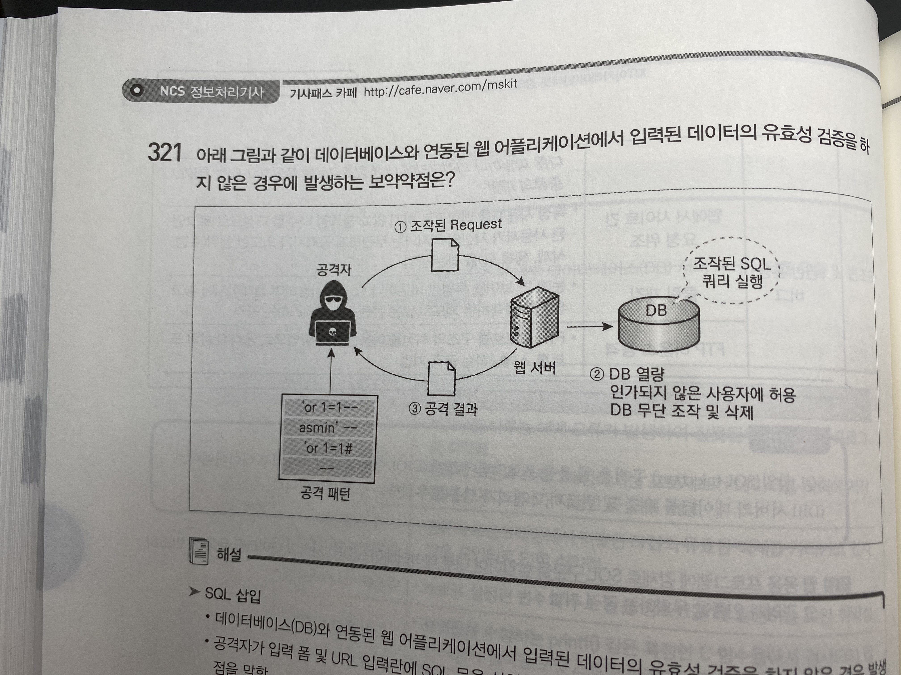

<details> <summary>답</summary> <div markdown="1">  


  ```
SQL 삽입
  ```

</div> </details>

322. 다음 코드에서 문제점을 설명하고 개선된 코드 작성하기

```java
String param = request.getParameter("id");
.....
String sql = "select name from board where id = "+param+" ";
Connection con = db.getConnection();
Statement stmt = con.createStatement();
ResultSet rs = stmt.executeQuery(sql);
```


<details> <summary>답</summary> <div markdown="1">  


  ```java
//문제점: id값에 싱글 쿼테이션 등 특수문자가 입력될 경우 SQL 구문이 변경되어 의도하지 않은 결과 유발 가능
String param = request.getParameter("id");
.....
String sql = "select name from board where id = "+param+" ";
Connection con = db.getConnection();
//여기서부터 변경!
PreparedStatement pstmt = con.prepareStatement(sql);
pstmt.setString(1,param);
ResultSet rs = pstmt.executeQuery();
  ```

</div> </details>

323. 다운로드를 요청하는 파일명을 입력받아 처리하는 코드의 일부이다. 경로 조작 및 자원삽입 보안약점을 제거하기 위해 추가해야 하는 전처리 작업의 내용을 설명하고 관련 코드 작성

```java
String fileName = request.getParameter("P");
(__)
fis = new FileInputStream("C:/datas/"+fileName);
```

<details> <summary>답</summary> <div markdown="1">  


  ```java
//안전한 코드로 바꾸는 방법: 외부의 입력을 자원의 식별자로 사용하는 경우, 적절한 검증을 거치도록 하거나 사전에 정의된 적합한 리스트에서 선택되도록 해야 함
String fileName = request.getParameter("P");
fileName = fileName.replaceAll("..","").replaceAll("/","").replaceAll(" ","");
fis = new FileInputStream("C:/datas"+fileName);
  ```

  ##### 해설(추가 개념)

    검증되지 않은 외부 입력값을 통해 파일 및 서버 등 시스템 자원에 대한 접근 혹은 식별을 허용할 경우, 입력값 조작을 통해 시스템이 보호하는 자원에 임의로 접근할 수 있는 보안약점이다.

</div> </details>

324. 괄호 채워넣기

```
(1)은 해커가 웹사이트의 입력값이나 URL에 SQL문을 삽입하여 DB로부터 정보를 열람하거나 조작, 파괴할 수 있는 보안 약점
(2)는 외부 입력값을 이용하여 웹페이지를 동적으로 구성하는 경우, 웹 페이지 사용자의 권한으로 부적절한 스크립트 실행을 유도함으로써, 정보유출 등의 문제를 유발할 수 있는 보안약점
```

<details> <summary>답</summary> <div markdown="1">  


  ```
1. SQL 삽입 2. 크로스사이트스크립트(XSS)
  ```

</div> </details>

327. #### 위험한 형식 파일 업로드 보안약점을 제거하기 위한 보안 대책을 2가지 이상 서술

<details> <summary>답</summary> <div markdown="1">  


  ```
1. 허용된 확장자만 업로드를 허용해야 함
2. 업로드된 파일을 저장할 때에는 파일명과 확장자를 추측 불가능한 임의의 문자열로 변경해야 함
3. 파일 저장경로를 외부에서 직접 접근이 불가능하도록 Web Document Root 외부에 저장해야 함.
  ```

</div> </details>

> 328~346, p2-181~2-205 코드 참고

347. #### 회원가입 시 아이디와 패스워드를 생성하는 기능에 대해 도출된 보안 요구사항 가운데 요구사항이 잘못 도출된 항목과 사유를 기술하고 올바르게 수정

```
ㄱ. 클라이언트 기기에서 입력되어 서버로 전송되는 아이디와 패스워드는 개인정보이므로 SSL 인증서 기반의 보안서버를 구축하여 전송구간 암호화를 구현해야ㄱ. 클라이언트 기기에서 입력되어 서버로 전송되는 아이디와 패스워드는 개인정보이므로 SSL 인증서 기반의 보안서버를 구축하여 전송구간 암호화를 구현해야함함
ㄴ. 패스워드는 레인보우 테이블 공격을 대비하기 위해 솔트를 적용하여 양방향 암호화 처리를 해야함
ㄷ. 패스워드의 해쉬처리는 클라이언트가 아닌 서버에서 수행해야 함
```

<details> <summary>답</summary> <div markdown="1">  


  ```
ㄴ이 잘못된 도출 항목: 패스워드 복호화가 불가능하도록 처리해야 하기 때문에 양방향 암호화가 아니라 일방향 해쉬 함수로 처리해야 함
  ```

</div> </details>

348. #### 괄호 채우기

```
ㄱ. 소프트웨어 보안테스트 유형에는 (1) 테스트와 (2) 테스트가 존재하며, 유형별로 장단점이 존재ㄱ. 소프트웨어 보안테스트 유형에는 (1) 테스트와 (2) 테스트가 존재하며, 유형별로 장단점이 존재름.
ㄴ. (1) 보안 테스트는 소프트웨어의 설계 및 구현 방법에 대한 지식을 기반으로 데이터 및 제어 흐름, 인터페이스, 환경설정, 에러 처리 등을 소프트웨어를 실행하지 않은 상태에서 수행하는 정적분석방법(소프트웨어 보안약점진단)
ㄷ. (2) 보안 테스트는 소프트웨어에 대한 사전 지식이 전혀 없고 내부 구조를 고려하지 않은 상태에서 입력에 따른 행위를 분석하기 위해 소프트웨어를 실행하여 테스트하는 동적분석방법으로 모의 해킹 또는 침투테스트라고도 부름
```

<details> <summary>답</summary> <div markdown="1">  


  ```
1. 화이트박스
2. 블랙박스
  ```

  ##### 해설(추가 개념) -  수제비, p7-4

- **정적 테스트**: 동료 검토, 워크 스루, 인스펙션(동워인)
  - 동료 검토: 2~3명이 리뷰하는 형태
  - 워크 스루: 검토 자료를 회의전에 배포에서 사전검토한 후 짧ㅅ은 시간동안 회의 진행
  - 인스펙션: 저작자 외의 다른 전문가 또는 팀이 검사하여 오류를 찾아내는 공식적 검토 기법
- **동적 테스트**: 화이트 박스 테스트, 블랙 박스 테스트
  - **화이트 박스**: 프로그램 내부 로직을 보면서 수행하는 테스트(구조 테스트)
    - 테스트 유형: **제루**
      1. 제어구조 테스트: 소프트웨어의 논리적 복잡도 측정 후 수행 경로들의 집합을 정의하는 테스트
      2. 루프 테스트: 프로그램의 루프 구조에 국한해서 실시하는 테스트
  - 블랙박스: 프로그램 외부 사용자의 요구사항 명세를 보면서 수행하는 테스트(기능 테스트)
    - 테스트 유형: **동경결상유분배**
      1. 동등 분할 테스트: 입력 데이터의 영역을 유사한 도메인별로 유효 값/무효 값을 그룹핑하여 대표값 테스트 케이스를 도출하여 테스트하는 기법
      2. 경계 값 분석 테스트: 등가분할 후 경계 값 부분에서 오류 발생 확률이 높기에 경계 값을 포함하여 테스트 케이스를 설계하여 테스트하는 기법
      3. 결정 테이블 테스트: 요구사항의 논리와 발생 조건을 테이블 형태로 나열하여, 조건과 행위를 모두 조함하여 테스트하는 기법
      4. 상태전이 테스트: 테스트 대상/시스템이나 객체의 상태를 구분하고, 이벤트에 의해 어느 한 상태에서 다른 상태로 전이되는 경우의 수를 수행하는 테스트 기법
      5. 유스케이스 테스트: 프로세스 흐름을 기반으로 테스트 케이스를 명세화하여 수행하는 테스트 기법
      6. 분류트리 테스트: SW의 일부 또는 전체를 트리 구조로 분석 및 표현하여 테스트 케이스를 설계하여 테스트하는 기법
      7. 페어와이즈 기법: Test data 값들 간에 최소한 한 번씩 조합하는 방식

</div> </details>

<hr>

## PART 11 프로그래밍언어 활용

356. #### 예상 출력값은?(파이썬, p2-219)

     ```python
     string = input(“7문자 이상 문자열을 입력")
     m = string[0:2] + string[-4:]
     print(m)
     입력값: Hello World
     ```

풀이: string[0:2] -> 인덱스 0부터 2까지 출력,string[-4:] ->뒤에서부터 4개 출력<br>

정답:Heorld<br>


357. #### 브라우저의 주소창에서 디렉토리 경로를 상위 경로로 임의로 이동하여 특정 디렉토리 내의 파일을 다운로드하는 공격기법은? (p2-220)

     답: 디렉토리 접근 공격<br>

     추가 개념:

     | 보안 취약점        | 보안 요구 항목                                               |
     | ------------------ | ------------------------------------------------------------ |
     | FTP 바운스 공격    | FTP 서버의 전송 목적지 주소를 임의로 지정하여 FTP 서버를 경유해 임의의 목적지로 메시지나 파일을 전송하는 공격 기법 |
     | SQL 삽입           | 공격자가 입력한 데이터에 대한 유효성을 점검하지 않아 SQL이 변경되어 정보의 유출 또는 DB의 변경을 가하는 공격기법 |
     | 버퍼 오버플로      | 메모리를 다루는 데 오류가 발생하여 잘못된 동작을 하는 프로그램 취약점 |
     | 디렉토리 접근 공격 | 브라우저의 주소창에서 디렉토리 경로를 상위 경로로 임의로 이동하여 특정 디렉토리 내의 파일을 다운로드하는 공격 기법 |


358. #### 응집도 수준 가장 높은 응집도 이름은?

     - 답: 기능적 응집도
       - 추가 개념:
         - 응집도는 높을수록 좋고 결합력은 낮을수록 좋음
         - 응집도: 우논시절통순기(낮->높)

359. #### 자료 결합도란?

     - 답: 모듈 간의 인터페이스로 전달되는 파라미터를 통해서만 모듈 상호 작용이 일어나는 결합도를 의미
       - 추가 개념:
         - 결합도는 낮을수록 좋음!
         - 결합도: 자스제외공내(높->낮)

#### 수제비 개념:

- 데이터 타입의 유형: 불린, 문자, 문자열, 정수, 부동 소수점 타입(Floating point type),배열

- 파이썬에서 for문:

  ```python
  //range에 시작값과 끝값+1로 정의할 경우 끝값-시작값만큼 반복, 1씩 증가
  for 변수 in range (시작값, 끝값+1) :
  	명령문
  ```

  ```python
  //range에 반복횟수를 정의한 경우 0부터 반복횟수-1까지 변수가 1씩 증가
  for 변수 in range (반복횟수) :
  	명령문
  ```

실행하는 방식에 따른 언어 분류:

| 종류          | 설명                                                         |
| ------------- | ------------------------------------------------------------ |
| 명령형 언어   | - 컴퓨터에 저장된 명령어들이 순차적으로 실행되는 프로그래밍 방식<br />- 절차형 언어 <br>- ex) FORTRAN, COBOL, PASCAL, C |
| 객체지향 언어 | - 객체 간의 메시지 통신을 이용하여 프로그래밍하는 방식<br />- ex) JAVA, C++ |
| 함수형 언어   | - 수학적 수식과 같은 함수들로 프로그램을 구성하여 호출하는 방식<br />- ex) LISP |
| 논리형 언어   | - 논리 문장을 이용하여 프로그램을 표현하고 계산을 수행하는 개념에 기반한 프로그래밍 방식<br />- ex) 프롤로그 |

구현 기법에 따른 언어 분류:

| 종류                   | 설명                                                         |
| ---------------------- | ------------------------------------------------------------ |
| 컴파일 방식의 언어     | - 고급 언어를 기계어로 번역하는 방식의 언어<br />- 컴파일러에 의해 필요한 정보가 미리 계산되어 실행 속도가 높음<br />- *컴파일러: 고급 언어를 기계어로 번역하는 프로그램이자 도구*<br />- ex) FORTRAN, PASCAL, C, C++ |
| 인터프리터 방식의 언어 | - 고급 언어 명령문을 하나씩 번역하고 실행하는 방식의 언어<br />- 프로그램 실행과 동시에 동작<br />- ex) BASIC, 프롤로그, LISP |
| 혼합형 방식의 언어     | - 고급 언어를 컴파일하여 중간 언어로 변환한 후, 인터프리터에 의해 번역을 실행하는 방식의 언어<br />- ex) 자바 |

- 절차적 프로그래밍 언어 종류: 알골, C언어, 베이직, FORTRAN
- 객체지향 프로그래밍 언어 종류: C++, C#, JAVA, 델파이
- 스크립트 언어 종류: 파이썬, php, 펄, 자바스크립트

<br>

객체지향 프로그래밍의 구성 요소:

1. 객체(object)
2. 클래스
3. 메시지: 객체 간의 통신

<br>

객체의 구성요소:

1. 개체(entity)
2. 속성(attribute)
3. 메서드(method)

<br>

- 라이브러리란? 효율적인 프로그램 개발을 위해 필요한 프로그램을 모아 놓은 집합체
  - 구성: 도움말, 설치파일, 샘플 코드


- 모듈 vs 패키지
  - 모듈: 전역변수, 함수 등을 모아둔 파일
  - 패키지: 모듈을 디렉터리 형식으로 구조화한 라이브러리

<hr>

## PART 12 응용 SW 기초기술 활용

> p2-225~

360. #### 처리 중인 데이터나 처리 결과나 처리 결과를 임시 보관하는 기능을 하며 산술 연산이나 정보 해석, 전송 등을 할 수 있는 일정 길이의 정보를 저장하는 CPU 내부의 초고속 기억장치는?

- 답: 레지스터
- 추가 종류: 
  - PC(Program Counter): 다음 인출할 명령어 주소를 가지고 있는 레지스터
  - MAR(Memory Address Register): 메모리 주소를 일시적으로 저장하는 사용되는 레지스터
  - MBR(Memory Buffer Register): 기억장치에 쓰여질 데이터 혹은 기억장치로부터 읽혀진 데이터를 일시적으로 저장하는 버퍼 레지스터
  - IR(Instruction Register): 가장 최근에 인출된 명령어 코드가 저장되어 있는 레지스터
  - AC(Accumulator): 데이터나 연산결과를 일시적으로 저장하는 레지스터

364. #### 인터럽트 처리 루틴 순서

답: 인터럽트 인식->현재 상태 보존 -> 요청 인터럽트 서비스로 분기 및 서비스 -> 사용자 상태 복구 및 재개

365. #### 명령어 수행과정

답: 명령어 인출(IF) -> 명령어 해독(ID) ->명령어 실행(EX) ->데이터 저장(WB)

366. #### 프로세스가 실행되면서 특정 메모리 페이지를 일정 시간동안 집중적으로 액세스하는 현상?

- 답: Locality(구역성, 지역성, 국부성, 국소성)
- 추가 종류:
  - 시간 구역성: 최근에 액세스된 프로그램이나 데이터가 가까운 미래에. 다시 액세스 될 가능성이 높음
  - 공간 구역성: 기억장치 내 인접하여 저장된 데이터들이 연속적으로 액세스 될 가능성이 높음
  - 순차 구역성: 분기 하지 않은 한, 명령어들은 기억장치에 저장된 순서대로 인출되어 실행됨.

367. #### 인터럽트 체제 구현방식 중 소프트웨어에 의한 우선순위 구현방식은? 

답: 폴링(Polling) 방식

368. #### 입출력 장치 제어기가 CPU에 의한 프로그램의 실행 없이 자료의 이동을 하는 방식?

- 답: DMA(Direct Memory Access)
- 추가 개념:
  - Isolated I/O : IN, OUT 명령에 의해 주어진 I/O 포트에 입출력 기기가 접속되어 입출력 수행
  - Interrupt I/O : 데이터 전송을 마이크로컴퓨터의 인터럽트 기능을 가진 하드웨어에 의해서 제어하는 방식

369. #### 시스템 소프트웨어 중 실행 가능한 프로그램을 기억 장치로 적재하는 역할

- 답: 로더(Loader)
- 추가 개념(시스템 소프트웨어의 종류와 기능):
  - **운영 체제**: 하드웨어와 소프트웨어 자원 관리, 컴퓨터 프로그램을 위한 공통 서비스를 제공하는 프로그램
  - **어셈블러**: 어셈블리어를 기계어로 변환해주는 프로그램
  - **컴파일러**: 고급 언어를 기계어로 바꾸어 주는 프로그램
  - **인터프리터**: 고급 언어나 코드를 입력 받아 직접 기계어를 생성하여 실행해주는 프로그램
  - **전처리기**: 원시 프로그램을 번역하기 전에 미리 언어의 기능을 확장한 원시 프로그램을 생성하는 시스템 프로그램
  - **링커**: 서로 독립적으로 작성되고 번역된 목적 프로그램을 호출 및 연계시키는 시스템 프로그램
  - **로더**: 실행 코드를 주기억장치에 적재하여 실행 가능하도록 해주는 시스템 프로그램

370. #### 로더의 단계별 동작

답: Allocation(할당) -> Linking(링킹) -> Relocation(재배치) -> Loading(적재)

371. #### 로더의 종류 중 별도의 로더 없이 언어 번역 프로그램이 로더의 기능까지 수행하는 방식은?

- 답: 컴파일 즉시 로더

- 추가 개념:

| 배치 유형        | 설명                                                         |
| ---------------- | ------------------------------------------------------------ |
| 컴파일 즉시 로더 | - 가장 간단한 방법<br />- 번역기가 로더의 역할까지 담당<br />- 로더의 기능은 단순히 실행을 제어<br />- 어셈블러의 재번역 요구<br />- 서로 다른 언어로 작성된 모듈 간 연결 불가 |
| 절대 로더        | - 출력결과는 보조 기억장치에 저장<br />- 기계어 코드 프로그램에서 미리 지정한 번지에 프로그램과 데이터를 직접 적재<br />- 프로그래머가 어셈블러에게 적재주소 지정 |
| 재배치 로더      | - 적재 모듈을 주기억장치에 적재<br />- 상대주소를 절대주소로 변환<br />- 로드 과정에서 메모리의 적당한 영역을 찾아 로드 |
| 링킹 로더        | - 재배치 링크 및 적재를 한꺼번에 수행<br />- 두 단계 패스로 구성<br />   패스1. 모듈에 기억장소 할당, 외부 기호들의 주소 확정, 외부 기호표 작성<br />   패스2. 모든 상대주소를 절대주소로 변환, 외부 기호표 참조 후 적재 |
| 동적 로더        | - 재배치 로더와 링킹 로더의 단점 보완<br />- CPU가 현재 사용 중인 부분만 로드<br />- 미사용 중인 프로그램은 보조기억장치에 저장해 두는 방식<br />- 서브루틴들의 상호 호출관계 파악 |

376. #### UNIX에서 컴퓨터 내부를 관리하는 커널과 사용자 간의 인터페이스를 담당하며, 세션 별 변수 설정 등 사용자 지정 상태로 사용자가 요청한 명령어를 해석하는 기능을 하는 것은?

답: 쉘

377. #### 단위 시간 내에 하나 이상의 명령어를 중첩 수행하여 퍼포먼스를 향상시키는 멀티프로세스 환경에서의 명령어 처리 메커니즘을 무엇이라고 하는가?

- 답: 파이프라인 기법
- 추가 개념:

| 유형(파이프라인)                 | 설명                                                         |
| -------------------------------- | ------------------------------------------------------------ |
| **단일**                         | 명령어 수행과정에서 각 단계를 한번만 중첩하여 다수의 동작을 동시에 수행하는 병렬처리 기술 |
| **수퍼**                         | 하나의 파이프라인을 여러 부분으로 나누어 연속적인 흐름과정으로 처리, 성능을 향상시키는 병렬처리 기술 |
| **Super** **Scalar**             | 프로세서 내에 파이프라인 된 ALU를 여러 개 포함하여 매 사이클마다 다수의 명령어들을 동시에 실행하는 병렬처리 기술 |
| **Super Pipelined Super Scalar** | 슈퍼스칼라 기법에 슈퍼 파이프라이닝 기법 적용                |
| **VLIW**                         | 동시에 수행될 수 있는 명령어들을 컴파일러 수준에서 추출, 하나의 명령어로 압축하여 수행하는 병렬처리 기술 |


378. #### Flynn의 컴퓨처 시스템 분류 제안 중에서 다수의 데이터 흐름이 다수의 프로세서들로 전달되며, 각 프로세서는 서로 다른 명령어를 실행하는 구조는?

- 답: 다중 명령어, 다중 데이터 흐름(MIMD, Multiple Instruction, Multiful Data Streams)
- 추가 개념(분류):
  - 단일명령어/단일 데이터흐름(SISD)
  - 단일명령어/다중 데이터 흐름(SMID)
  - 다중명령어/단일 데이터 흐름(MISD)
  - 다중명령어/다중 데이터 흐름(MIMD)

379. #### 운영체제 유형 중, 2개 이상의 프로그램을 주기억장치에 기억시키고 CPU를 번갈아 사용하면서 처리하여 컴퓨터 시스템 자원 활용률을 극대화하기 위한 프로그래밍 기법은?

- 답: 멀티 프로그래밍
- 추가 개념(운영 체제 유형별):

| 유형                                        | 개념                                                         |
| ------------------------------------------- | ------------------------------------------------------------ |
| **다중 프로그래밍 시스템(멀티 프로그래밍)** | CPU의 효율을 극대화하기 위해 여러 개의 프로그램이 마치 동시에 실행되는 것처럼 처리하는 방식 |
| **시분할 시스템**                           | 프로세서 스케줄링과 다중 프로그래밍을 사용해 각 사용자에게 컴퓨터를 시간적으로 분할 사용 |
| **분산처리 시스템**                         | 시스템마다 운영 체제와 메모리를 가지고 독립적으로 운영되며 필요할 때 통신하는 시스템 |
| **다중처리 시스템**                         | 마이크로 프로세서 여러 개를 연결해 다중 프로세서를 생성      |
| **일괄처리 시스템**                         | 일정량의 데이터를 모아서 한꺼번에 일괄처리하는 방식          |
| **실시간처리 시스템**                       | 데이터에 대한 처리요구 발생 시 즉시 처리 응답                |

380. #### 중앙 컴퓨터와 직접 연결되어 응답이 빠르고 통신비용이 적게 소요되지만, 중앙 컴퓨터에 장애가 발생하면 전체 시스템이 마비되는 분산 시스템의 위상 구조는?

- 답: 성형 구조(star)
- 추가 개념(구조 분류):
  - **완전 연결 구조**: 모든 노드가 서로 연결됨
  - **부분 연결 구조** : 완전 연결보단 신뢰성 떨어지고 통신 속도가 늦음
  - **계층 구조**: 트리 형태로 구성
  - **성형 구조** : 중심 노드는 타 노드와 연결, 타 노드는 상호간 연결되지 않는 방식
  - **환형 구조(ring)**: 단방향, 양방향 통신 존재
  - **다중 접근 버스 구조**: 공유되는 하나의 버스 존재

> 381 문제 p2-252 참고!!

382. #### 가상기억장치 구현에서 고정되게 분할한 용량(페이지)을 주기억장치에 사상시키는 기법?

답: 페이징 기법

- 추가 개념: 세그멘테이션 기법 -> 가상기억장치 내의 프로그램과 데이터를 각 세그먼트가 주기억장치에 적재될 때마다 필요한 서로 다른 크기의 세그먼트로 분할

383. #### 운영체제의 운영 기법 중 동시에 프로그램을 수행할 수 있는 CPU를 두 개 이상 두고 각각 그 업무를 분담하여 처리할 수 있는 방식?

답: 다중 처리 시스템(**379번 참고!!**)

384. #### 물리적인 메모리 용량보다 더 큰 용량의 프로그램을 실행할 수 있도록 보조 기억 장치 용량에 해당하는 용량만큼 메모리 용량을 확장하여 사용할 수 있도록 하는 기법은?

<details> <summary>답</summary> <div markdown="1">  


  ```
가상 메모리/가상 기억장치, Virtual Memory(VM)
  ```

</div> </details>

385. #### OS의 가상기억장치 관리에서 프로세스가 일정 시간동안 자주 참조하는 페이지들의 집합을 의미하는 것으로 스래싱(Thrashing)을 방지하는 기법은?

<details> <summary>답</summary> <div markdown="1">  


  ```
워킹세트(Working set)
  ```

</div> </details>

386. #### 연속된 데이터 또는 명령어들을 기억장치 모듈에 순차적으로 번갈아 가면서 처리하는 방식은?

<details> <summary>답</summary> <div markdown="1">  


  ```
메모리 인터리빙, 기억 장치 끼워넣기
  ```

</div> </details>

387. 메모리의 페이지 교체기법 중 가장 오랫동안 사용되지 않을 페이지를 교체기법은?

<details> <summary>답</summary> <div markdown="1">  


  ```
LRU(Least Recently Used System), 최저 사용 빈도
  ```

##### 해설(추가 개념)

페이지 교체 알고리즘:

| 구분                                                    | 내용                                                         | 특징                                                         |
| ------------------------------------------------------- | ------------------------------------------------------------ | ------------------------------------------------------------ |
| **무작위 페이지 교체<br />/Random Page Replacement**    | 특별한 사용자에게 차이를 ㄷ지 않고 교체할 페이지를 무작위로 선정해 교체하는 기법 | 오버헤드가 적고 바로 뒤에 참조될 페이지도 교체 가능          |
| **FIFO/선입선출**                                       | 메모리에 올라온 지 가장 오래된 페이지를 교체                 | 선입선출 이상현상 발생: 프로세스에 더 많은 페이지를 할당할 경우 더 많은 페이지 부재가 발생하는 현상 |
| **OPR/최적 페이지 교체<br />/Optimal Page Replacement** | 앞으로 가장 오랫동안 사용되지 않을 페이지를 찾아 교체        | FIFO의 모순을 해결, 구현이 비현실적                          |
| **LRU/최저 사용 빈도<br />/Least Recently Used**        | 가장 오랫동안 사용되지 않을 페이지 교체                      | 호출시간을 기록해야 하는 오버헤드 발생하나 효율적            |
| **LFU/최소 사용 빈도<br />/Least Frequently Used**      | 사용빈도가 가장 적은 페이지를 교체하는 기법                  | 구역성 문제 발생                                             |
| **NUR/최근 사용 전무<br />/Not Used Recently**          | 최근에 사용되지 않은 페이지를 교체하는 기법                  | 참조비트, 변경 비트 사용, LRU 시간 오버헤드 해결             |

</div> </details>

<hr>

## EXTRA1 인터페이스 구현


> 수제비 참고


