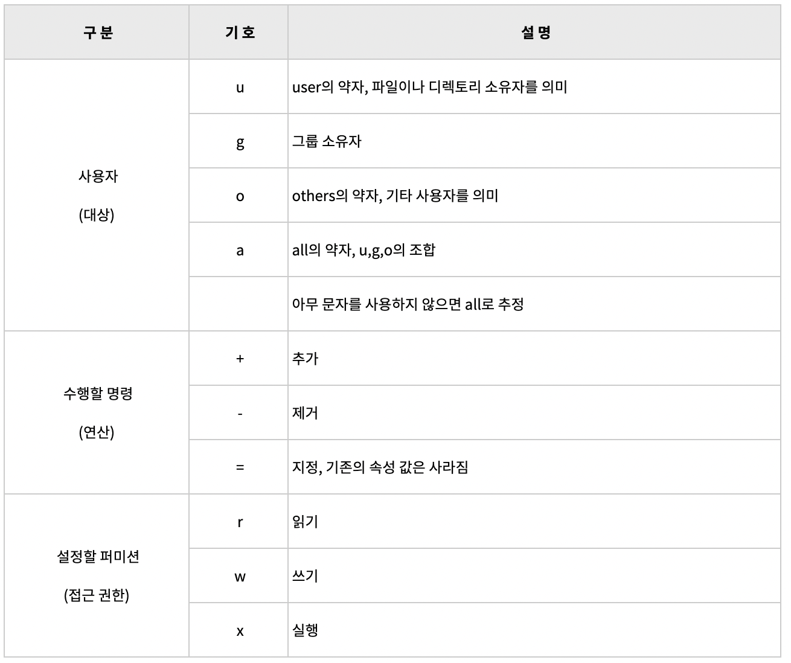
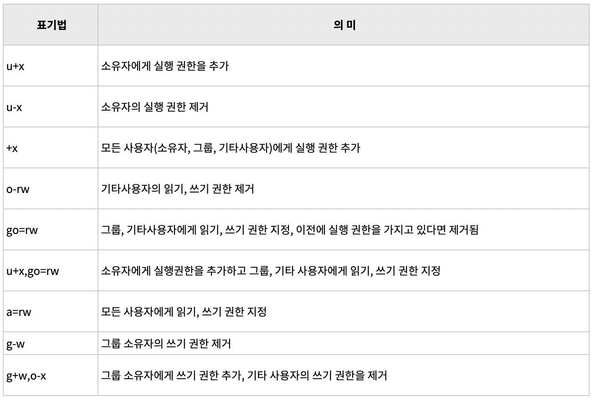

# 리눅스 마스터 0228

### 사용자 파일 접근권한

Chmod [옵션] [권한 값] [권한 값] [특정 파일 / 디렉토리]

옵션:

1. -R: 디렉터리 안에 있는 파일 모두 변경
2. -C: 변경된 정보를 출력
3. -V: 명령어 버s전 정보 출력

권한:

1. r: read(읽어들이기)
2. w: write(생성 삭제)
3. x: 디렉터리 내부 접근
4. s:Group 권한의 접근 권한(x)자리에 x대신 s가 들어가면 이를 SetGID라 칭함

**참고**: w가 파일에 부여되는 권한은 *수정할 수 있는 권한*, 디렉터리에 부여되는 권한은 *파일을 생성 또는 삭제할 수 있는 권한*

### fdisk

> fdisk명령어는 파티션테이블을 관리하는 명령어로 리눅스의 디스크파티션을 생성, 수정, 삭제할 수 있는 일종의 유틸리티

- 명령어 위치: /sbin/fdisk
- 사용 형식: `disk [-l][-v][-s 파티션][장치이름]`
- `#fdisk -l`: 현재 모든 디스크의 파티션 설정 현황 파악

Swap 파일 시스템: 리눅스의 가상 메모리를 사용하기 위한 파일 시스템 ->t 명령어로 id값을 82번으로 변경 후 저장 

LVM: 리눅스 설치시 또는 하드디스크 추가 시 파티션을 나누고 공간을 할당. 이때 한번 설정한 공간을 고정되어 변경이나 추가 부가. Logical Volume Manager는 파티션을 원하는대로 추가하거나 제거하고 그 크기도 조절할 수 있도록 해주는 방법

### 디스크 쿼터 설정

`# edquota ihduser<- 사용자 이름`

### 저널링

