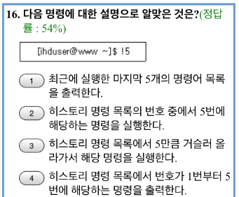

# study 0304

해설: 

- mkfs : 파티션한 하드디스크 포맷
- fsck: 리눅스 파일 시스템을 검사하고 수리하는 명령 :heavy_check_mark:
- free: 메모리 확인
- fdisk: 파티션레이블 관리

해설: 

아무런 인자 없이 umask를 치면 0002가 나옴

해설: 

디렉터리의 소유권을 하위 디렉터리 및 파일을 포함하여 소유권을 변경하는 경우 -R이 들어감

해설: 

- env: 글로벌 환경변수 조회 명령어
- set: 로컬환경변수 조회 명령어 + 쉘 환경을 설정할 수 있는 옵션기능
- 셸에서 선언된 셸 변수라는게 set

해설: 

- /bin: 기본적인 명령어
- /sbin: 시스템 관리를 위한 명령어

해설: 

- 최근에 실행한 마지막 5개 명령어 목록을 출력 = history 5

해설: 

- sh->csh->tcsh->ksh->bash->zsh 순서